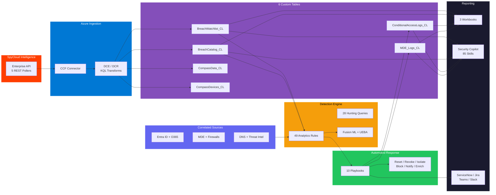

<div align="center">


<br><br>


<br><br>

<a href="https://portal.azure.com/#create/Microsoft.Template/uri/https%3A%2F%2Fraw.githubusercontent.com%2Fiammrherb%2FSPYCLOUD-SENTINEL%2Fmain%2Fazuredeploy.json/createUIDefinitionUri/https%3A%2F%2Fraw.githubusercontent.com%2Fiammrherb%2FSPYCLOUD-SENTINEL%2Fmain%2FcreateUiDefinition.json"></a>&nbsp;&nbsp;
<a href="https://portal.azure.us/#create/Microsoft.Template/uri/https%3A%2F%2Fraw.githubusercontent.com%2Fiammrherb%2FSPYCLOUD-SENTINEL%2Fmain%2Fazuredeploy.json/createUIDefinitionUri/https%3A%2F%2Fraw.githubusercontent.com%2Fiammrherb%2FSPYCLOUD-SENTINEL%2Fmain%2FcreateUiDefinition.json"></a>&nbsp;&nbsp;
<a href="https://github.com/iammrherb/SPYCLOUD-SENTINEL"></a>

<br><br>


<br><br>

**Recaptured darknet intelligence. Automated identity threat protection.**<br>
<sub>Detect compromised credentials hours after recapture -- not weeks after breach disclosure.</sub>

</div>

<br>

<!-- ============================================================ -->
<!-- WHY SPYCLOUD SENTINEL -->
<!-- ============================================================ -->

<div align="center">

</div>

<br>

<table>
<tr>
<td width="25%" align="center">
<br><br>
<strong>Faster Than Breach Databases</strong><br>
<sub>SpyCloud recaptures stolen data from botnets and underground markets months before public disclosure. You get alerts in hours.</sub>
</td>
<td width="25%" align="center">
<br><br>
<strong>Deep Signal Correlation</strong><br>
<sub>Every exposure is cross-referenced against Entra ID, O365, MDE, UEBA, firewalls, DNS, and threat intel -- automatically.</sub>
</td>
<td width="25%" align="center">
<br><br>
<strong>Fully Orchestrated Response</strong><br>
<sub>From detection to password reset, session revocation, device isolation, and SOC notification -- all hands-free.</sub>
</td>
<td width="25%" align="center">
<br><br>
<strong>Production in Minutes</strong><br>
<sub>ARM template with guided wizard. Deploy the full solution -- connector, rules, playbooks, workbooks -- in a single operation.</sub>
</td>
</tr>
</table>

<br>

<!-- ============================================================ -->
<!-- WHAT'S INCLUDED -->
<!-- ============================================================ -->

<div align="center">

</div>

<br>

<div align="center">
<table>
<tr>
<td align="center" width="14%">
<br>
<strong>Analytics<br>Rules</strong>
</td>
<td align="center" width="14%">
<br>
<strong>Remediation<br>Playbooks</strong>
</td>
<td align="center" width="14%">
<br>
<strong>Dashboard<br>Workbooks</strong>
</td>
<td align="center" width="14%">
<br>
<strong>Hunting<br>Queries</strong>
</td>
<td align="center" width="14%">
<br>
<strong>Copilot<br>Skills</strong>
</td>
<td align="center" width="14%">
<br>
<strong>Custom<br>Tables</strong>
</td>
<td align="center" width="14%">
<br>
<strong>API<br>Pollers</strong>
</td>
</tr>
</table>
</div>

<br>

<!-- ============================================================ -->
<!-- ARCHITECTURE -->
<!-- ============================================================ -->

<div align="center">

</div>

<br>



<br>

<!-- ============================================================ -->
<!-- QUICK START -->
<!-- ============================================================ -->

<div align="center">

</div>

<br>

<table>
<tr>
<td width="33%" align="center">
<br><br>
<strong>Click Deploy to Azure</strong><br>
<sub>Complete the 8-step guided wizard.<br>Select your workspace, rules, and playbooks.</sub><br><br>
<a href="https://portal.azure.com/#create/Microsoft.Template/uri/https%3A%2F%2Fraw.githubusercontent.com%2Fiammrherb%2FSPYCLOUD-SENTINEL%2Fmain%2Fazuredeploy.json/createUIDefinitionUri/https%3A%2F%2Fraw.githubusercontent.com%2Fiammrherb%2FSPYCLOUD-SENTINEL%2Fmain%2FcreateUiDefinition.json"></a>
</td>
<td width="33%" align="center">
<br><br>
<strong>Run Post-Deploy Script</strong><br>
<sub>Grants managed identity permissions,<br>configures RBAC, and validates the deployment.</sub><br><br>
<code>./scripts/post-deploy-auto.sh -g RG -w WS</code>
</td>
<td width="33%" align="center">
<br><br>
<strong>Verify & Monitor</strong><br>
<sub>Run the verification script. Open the<br>Executive Dashboard workbook in Sentinel.</sub><br><br>
<code>./scripts/verify-deployment.sh</code>
</td>
</tr>
</table>

<br>

<!-- ============================================================ -->
<!-- DEPLOYMENT OPTIONS -->
<!-- ============================================================ -->

<div align="center">

</div>

<br>

| | Method | Best For | Action |
|:---:|--------|----------|--------|
|  | **Azure Portal** | Most users -- guided 8-step wizard | [](https://portal.azure.com/#create/Microsoft.Template/uri/https%3A%2F%2Fraw.githubusercontent.com%2Fiammrherb%2FSPYCLOUD-SENTINEL%2Fmain%2Fazuredeploy.json/createUIDefinitionUri/https%3A%2F%2Fraw.githubusercontent.com%2Fiammrherb%2FSPYCLOUD-SENTINEL%2Fmain%2FcreateUiDefinition.json) |
|  | **Azure Cloud Shell** | CLI-native engineers, CI/CD pipelines | [](https://shell.azure.com) |
|  | **Terraform** | Infrastructure-as-code teams | `cd terraform && terraform apply` |
|  | **GitHub Actions** | GitOps / automated CI/CD | `.github/workflows/deploy-sentinel.yml` |
|  | **Azure DevOps** | Enterprise pipeline teams | ADO Pipeline YAML |
|  | **SpyCloud Integration Portal** | Existing SpyCloud customers | [portal.spycloud.com](https://portal.spycloud.com) |

<details>
<summary></summary>

```bash
curl -sL https://raw.githubusercontent.com/iammrherb/SPYCLOUD-SENTINEL/main/scripts/deploy-all.sh | bash
```

Or clone and run with parameters:

```bash
git clone https://github.com/iammrherb/SPYCLOUD-SENTINEL.git && cd SPYCLOUD-SENTINEL
./scripts/deploy-all.sh -g rg-spycloud -w law-spycloud -k YOUR_API_KEY -l eastus --non-interactive
```

</details>

<details>
<summary></summary>

```hcl
# terraform.tfvars
subscription_id       = "00000000-0000-0000-0000-000000000000"
resource_group_name   = "rg-spycloud-sentinel"
location              = "eastus"
workspace_name        = "law-spycloud-sentinel"
create_new_workspace  = true
enable_mde_playbook   = true
enable_ca_playbook    = true
enable_key_vault      = true
enable_analytics_rules = true
```

```bash
export TF_VAR_spycloud_api_key="your-api-key"
terraform init && terraform plan && terraform apply
```

</details>

<details>
<summary></summary>

```yaml
name: Deploy SpyCloud Sentinel
on:
  push:
    branches: [main]
  workflow_dispatch:
    inputs:
      deployment_mode:
        type: choice
        options: [Full, Upgrade, RulesOnly, PlaybooksOnly, ConnectorOnly]

permissions:
  id-token: write
  contents: read

jobs:
  deploy:
    runs-on: ubuntu-latest
    environment: production
    steps:
      - uses: actions/checkout@v4
      - uses: azure/login@v2
        with:
          client-id: ${{ secrets.AZURE_CLIENT_ID }}
          tenant-id: ${{ secrets.AZURE_TENANT_ID }}
          subscription-id: ${{ secrets.AZURE_SUBSCRIPTION_ID }}
      - uses: azure/arm-deploy@v2
        with:
          resourceGroupName: ${{ secrets.RESOURCE_GROUP }}
          template: ./azuredeploy.json
          parameters: >
            workspace=${{ secrets.WORKSPACE_NAME }}
            deploymentMode=${{ github.event.inputs.deployment_mode || 'Full' }}
```

</details>

<br>

<!-- ============================================================ -->
<!-- ANALYTICS RULES -->
<!-- ============================================================ -->

<div align="center">

</div>

<br>

<div align="center">
<sub>All rules are <strong>enabled by default</strong> and deploy with a single click.</sub>
</div>

<br>

<details>
<summary> &nbsp; <sub>SpyCloud tables only -- no additional data sources required</sub></summary>

| ID | Rule Name | Severity |
|:---:|-----------|:--------:|
| sc-001 | Infostealer Credential Exposure (severity >= 20) |  |
| sc-002 | Plaintext Password Exposure |  |
| sc-003 | Session Cookie Theft / MFA Bypass (severity 25) |  |
| sc-004 | PII / SSN / National ID Exposure |  |
| sc-005 | Executive / VIP User Credential Exposure |  |
| sc-006 | Multi-Domain Credential Reuse (3+ domains) |  |
| sc-007 | Device Reinfection Pattern (2+ infections) |  |
| sc-008 | High-Sighting Credential (>3 sources) |  |
| sc-009 | New Malware Family Targeting Organization |  |
| sc-010 | Stale Exposure Without Remediation (>48h) |  |
| sc-011 | Corporate Email on Consumer Site Breach |  |
| sc-012 | Credential Exposure Volume Spike (anomaly) |  |

</details>

<details>
<summary> &nbsp; <sub>Requires SigninLogs, AuditLogs, OfficeActivity</sub></summary>

| ID | Rule Name | Severity |
|:---:|-----------|:--------:|
| sc-020 | Exposed Credential + Successful Sign-in |  |
| sc-021 | Exposed User + Risky Sign-in |  |
| sc-022 | Exposed User + Impossible Travel |  |
| sc-023 | Exposed User MFA Registration Change |  |
| sc-024 | Exposed User Mailbox Rule Creation (BEC) |  |
| sc-025 | Exposed User OAuth App Consent |  |
| sc-026 | Exposed User Admin Role Assignment |  |
| sc-027 | Exposed User Self-Service Password Change |  |
| sc-028 | Exposed User eDiscovery Export |  |
| sc-029 | Exposed User SharePoint Mass Download |  |

</details>

<details>
<summary> &nbsp; <sub>Requires BehaviorAnalytics, CommonSecurityLog, DnsEvents</sub></summary>

| ID | Rule Name | Severity |
|:---:|-----------|:--------:|
| sc-030 | UEBA Anomalous Behavior from Exposed User |  |
| sc-031 | First-Time Access from Exposed User |  |
| sc-032 | Firewall Deny from SpyCloud Infected IP |  |
| sc-033 | Fortinet FSSO Session from Exposed User |  |
| sc-034 | PaloAlto User-ID Traffic from Exposed User |  |
| sc-035 | DNS C2 Communication from Infected Device |  |
| sc-036 | VPN New Location from Exposed User |  |
| sc-037 | Firewall Allow After Credential Exposure |  |
| sc-038 | MDE Infected Machine Active on Network |  |
| sc-039 | Lateral Movement from Compromised Account |  |

</details>

<details>
<summary> &nbsp; <sub>Multi-stage, conditional access, geographic, tool detection</sub></summary>

| ID | Rule Name | Severity |
|:---:|-----------|:--------:|
| sc-040 | Multi-Stage Attack Chain |  |
| sc-041 | Conditional Access Bypass from Exposed User |  |
| sc-042 | User Re-Exposed After Password Reset |  |
| sc-043 | TI Indicator Match on SpyCloud IP |  |
| sc-044 | Azure Firewall + SpyCloud IP Correlation |  |
| sc-045 | Sensitive Source Breach Detection |  |
| sc-046 | First-Time Domain Access from Exposed User |  |
| sc-047 | Credential Theft Tool Detection |  |
| sc-048 | Geographic Mismatch (exposure vs sign-in) |  |
| sc-049 | Check Point + SpyCloud IP Correlation |  |

</details>

<details>
<summary> &nbsp; <sub>Defender XDR, Entra Protection, Fusion ML</sub></summary>

| ID | Rule Name | Severity |
|:---:|-----------|:--------:|
| MSIC-1 | Defender XDR Correlated Exposure |  |
| MSIC-2 | Entra ID Protection Risk Correlation |  |
| MSIC-3 | Defender for Cloud App Anomaly |  |
| MSIC-4 | Intune Non-Compliant Exposed Device |  |
| MSIC-5 | Purview DLP + Exposed User |  |
| Fusion | Multi-Stage ML Attack Detection |  |

</details>

<br>

<!-- ============================================================ -->
<!-- PLAYBOOKS -->
<!-- ============================================================ -->

<div align="center">

</div>

<br>

<div align="center">
<sub>All playbooks are <strong>enabled by default</strong> with system-assigned managed identities.</sub>
</div>

<br>

| | Playbook | Category | What It Does |
|:---:|----------|:--------:|--------------|
|  | **ForcePasswordReset** | Identity | Forces password change with next-login MFA prompt |
|  | **RevokeSessions** | Identity | Immediately invalidates all active sign-in sessions |
|  | **EnforceMFA** | Identity | Deletes existing MFA methods, forces re-registration |
|  | **BlockConditionalAccess** | Access | Assigns user to severity-tiered Conditional Access group |
|  | **BlockFirewall** | Network | Pushes block rules to Fortinet / Palo Alto |
|  | **IsolateDevice** | Device | MDE full or selective isolation based on severity |
|  | **NotifyUser** | Notify | Emails user with breach details and required actions |
|  | **NotifySOC** | Notify | Teams Adaptive Card to SOC channel with action buttons |
|  | **EnrichIncident** | Enrich | Adds SpyCloud context, tags, and severity to incident |
|  | **FullRemediation** | Orchestration | Chains all playbooks in 3 phased stages |

<br>

<!-- ============================================================ -->
<!-- POST-DEPLOYMENT -->
<!-- ============================================================ -->

<div align="center">

</div>

<br>

> **All steps below are automated by the post-deploy script.** Run it once and verify.

```bash
# Automated: grants permissions, configures RBAC, validates everything
./scripts/post-deploy.sh -g YOUR_RG -w YOUR_WORKSPACE

# Verify: checks all 10 components (tables, connector, rules, playbooks, data flow)
./scripts/verify-deployment.sh -g YOUR_RG -w YOUR_WORKSPACE
```

<details>
<summary></summary>

| | Task | Automated |
|:---:|------|:---------:|
|  | Grant managed identity API permissions (Graph, MDE) | Yes |
|  | Assign RBAC roles (Sentinel Responder, Monitoring Metrics Publisher) | Yes |
|  | Verify data ingestion in custom tables (allow 15 min) | Yes |
|  | Confirm analytics rules are firing (check Incidents blade) | Yes |
|  | Populate VIP Watchlist with executive/admin emails | Manual |
|  | Configure ticketing integration (ServiceNow / Jira / ADO) | Optional |
|  | Set up notification channels (Teams / Slack / Email) | Optional |

</details>

<details>
<summary></summary>

<br>

**Required Azure RBAC Roles:**
Sentinel Contributor, Log Analytics Contributor, Logic App Contributor, Managed Identity Operator, Sentinel Automation Contributor

**Network:** Outbound HTTPS (443) to `api.spycloud.io` -- no inbound rules needed.

**SpyCloud API Key:** Obtain from [portal.spycloud.com](https://portal.spycloud.com) > Account Settings > API Keys

**Playbook Permissions (auto-granted by script):**

| Playbook | API Permission |
|----------|---------------|
| ForcePasswordReset / RevokeSessions | `User.ReadWrite.All` |
| EnforceMFA | `UserAuthenticationMethod.ReadWrite.All` |
| BlockConditionalAccess | `GroupMember.ReadWrite.All` |
| IsolateDevice | `Machine.Isolate` (MDE) |
| NotifyUser | `Mail.Send` |
| EnrichIncident | Sentinel Responder role |

</details>

<br>

<!-- ============================================================ -->
<!-- SUPPORT & LINKS -->
<!-- ============================================================ -->

<div align="center">

</div>

<br>

<div align="center">

<a href="https://github.com/iammrherb/SPYCLOUD-SENTINEL/issues"></a>&nbsp;
<a href="mailto:support@spycloud.com"></a>&nbsp;
<a href="https://learn.microsoft.com/azure/sentinel"></a>

<br><br>


<br>

<sub>
<strong>SpyCloud Sentinel</strong> -- Built on SpyCloud intelligence and Microsoft Sentinel.<br>
Protecting organizations from the consequences of stolen credentials.
</sub>

<br><br>

&nbsp;


</div>
