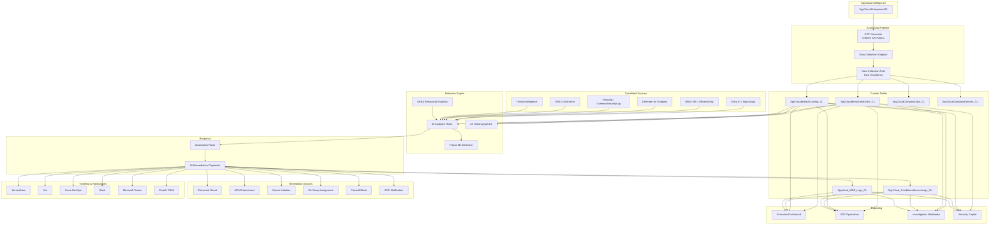

<div align="center">

# SpyCloud Sentinel — Enterprise Threat Intelligence

[](https://portal.azure.com/#create/Microsoft.Template/uri/https%3A%2F%2Fraw.githubusercontent.com%2Fiammrherb%2FSPYCLOUD-SENTINEL%2Fmain%2Fazuredeploy.json/createUIDefinitionUri/https%3A%2F%2Fraw.githubusercontent.com%2Fiammrherb%2FSPYCLOUD-SENTINEL%2Fmain%2FcreateUiDefinition.json)


**Transform recaptured darknet data into automated identity threat protection.**

*The most comprehensive SpyCloud integration for Microsoft Sentinel — featuring automated detection, investigation, and response across identity, device, network, and cloud.*

</div>

---

## Table of Contents

- [Overview](#overview)
- [Architecture](#architecture)
- [Features](#features)
  - [Data Connector](#data-connector)
  - [Analytics Rules](#analytics-rules)
  - [Playbooks](#playbooks)
  - [Workbooks](#workbooks)
  - [Hunting Queries](#hunting-queries)
  - [Ticketing Integration](#ticketing-integration)
  - [Notifications](#notifications)
- [MITRE ATT&CK Coverage](#mitre-attck-coverage)
- [Deployment](#deployment)
  - [Prerequisites](#prerequisites)
  - [Option 1: Azure Portal](#option-1-azure-portal-deploy-to-azure)
  - [Option 2: Azure Cloud Shell](#option-2-azure-cloud-shell)
  - [Option 3: GitHub Actions](#option-3-github-actions-cicd)
  - [Option 4: Azure DevOps Pipeline](#option-4-azure-devops-pipeline)
  - [Forking & Customization](#forking--customization)
- [Post-Deployment Guide](#post-deployment-guide)
- [Configuration](#configuration)
- [Use Cases](#use-cases)
- [Troubleshooting](#troubleshooting)
- [Roadmap](#roadmap)
- [Contributing](#contributing)
- [License](#license)

---

## Overview

**SpyCloud Sentinel** brings the full power of SpyCloud's recaptured darknet intelligence into Microsoft Sentinel. SpyCloud monitors criminal underground markets, botnets, and infostealer malware ecosystems to recapture stolen credentials, session cookies, PII, and device fingerprints — often **months before** they appear in public breach databases.

This solution automates the entire lifecycle:

1. **Ingest** — 5 REST API pollers continuously pull SpyCloud data into 6 custom Sentinel tables
2. **Detect** — 49 analytics rules correlate exposures with Entra ID, O365, firewalls, UEBA, MDE, and DNS
3. **Respond** — 10 playbooks automate password reset, MFA enforcement, device isolation, and CA enforcement
4. **Report** — Executive and SOC dashboards with real-time risk scoring and remediation tracking

### Value Proposition

| Without SpyCloud Sentinel | With SpyCloud Sentinel |
|---|---|
| Stolen credentials discovered weeks/months later | Real-time alerting within hours of credential recapture |
| Manual investigation of each exposure | Automated enrichment and correlation across 12+ data sources |
| Reactive password resets after breach notification | Proactive forced password reset + session revocation |
| No visibility into infostealer infections | Full device forensics with malware family identification |
| Siloed identity and endpoint response | Orchestrated remediation across identity, device, and network |

---

## Architecture



---

## Features

### Data Connector

The SpyCloud CCF (Codeless Connector Framework) connector deploys 5 REST API pollers:

| Poller | Table | Description | API Tier |
|--------|-------|-------------|----------|
| Watchlist (New) | `SpyCloudBreachWatchlist_CL` | New employee exposures | Enterprise |
| Watchlist (Modified) | `SpyCloudBreachWatchlist_CL` | Updated/re-sighted records | Enterprise |
| Breach Catalog | `SpyCloudBreachCatalog_CL` | Breach metadata & malware families | Enterprise |
| Compass Data | `SpyCloudCompassData_CL` | Consumer identity exposures | Enterprise+ |
| Compass Devices | `SpyCloudCompassDevices_CL` | Infected device fingerprints | Enterprise+ |

**6 Custom Tables** with **118+ columns** capturing the full breadth of SpyCloud intelligence.

### Analytics Rules

49 detection rules organized into 6 categories:

| Category | Rules | Data Sources Required |
|----------|-------|--------------------|
| **Core SpyCloud Detection** (sc-001–012) | 12 | SpyCloud tables only |
| **O365 & Entra ID Correlation** (sc-020–029) | 10 | SigninLogs, AuditLogs, OfficeActivity |
| **UEBA & Firewall** (sc-030–039) | 10 | BehaviorAnalytics, CommonSecurityLog, DnsEvents |
| **Advanced Threat Detection** (sc-040–049) | 10 | Multiple (varies per rule) |
| **Microsoft Security (MSIC)** | 5 | Defender XDR, Entra Protection, etc. |
| **Fusion Multistage ML** | 1 | All correlated sources |

<details>
<summary><strong>Click to see all 49 rules</strong></summary>

#### Core SpyCloud Detection (sc-001 to sc-012)
| ID | Name | Severity |
|---|---|---|
| sc-001 | Infostealer Credential Exposure (severity >= 20) | High |
| sc-002 | Plaintext Password Exposure | High |
| sc-003 | Session Cookie Theft / MFA Bypass (severity 25) | High |
| sc-004 | PII / SSN / National ID Exposure | High |
| sc-005 | Executive / VIP User Credential Exposure | High |
| sc-006 | Multi-Domain Credential Reuse (3+ domains) | Medium |
| sc-007 | Device Reinfection Pattern (2+ infections) | High |
| sc-008 | High-Sighting Credential (>3 sources) | Medium |
| sc-009 | New Malware Family Targeting Organization | Medium |
| sc-010 | Stale Exposure Without Remediation (>48h) | Medium |
| sc-011 | Corporate Email on Consumer Site Breach | Medium |
| sc-012 | Credential Exposure Volume Spike (anomaly) | Medium |

#### O365 & Entra ID Correlation (sc-020 to sc-029)
| ID | Name | Severity |
|---|---|---|
| sc-020 | Exposed Credential + Successful Sign-in | High |
| sc-021 | Exposed User + Risky Sign-in | High |
| sc-022 | Exposed User + Impossible Travel | High |
| sc-023 | Exposed User MFA Registration Change | High |
| sc-024 | Exposed User Mailbox Rule Creation (BEC) | High |
| sc-025 | Exposed User OAuth App Consent | High |
| sc-026 | Exposed User Admin Role Assignment | High |
| sc-027 | Exposed User Self-Service Password Change | Medium |
| sc-028 | Exposed User eDiscovery Export | High |
| sc-029 | Exposed User SharePoint Mass Download | High |

#### UEBA & Firewall (sc-030 to sc-039)
| ID | Name | Severity |
|---|---|---|
| sc-030 | UEBA Anomalous Behavior from Exposed User | High |
| sc-031 | First-Time Access from Exposed User | Medium |
| sc-032 | Firewall Deny from SpyCloud Infected IP | Medium |
| sc-033 | Fortinet FSSO Session from Exposed User | High |
| sc-034 | PaloAlto User-ID Traffic from Exposed User | High |
| sc-035 | DNS C2 Communication from Infected Device | High |
| sc-036 | VPN New Location from Exposed User | Medium |
| sc-037 | Firewall Allow After Credential Exposure | High |
| sc-038 | MDE Infected Machine Active on Network | High |
| sc-039 | Lateral Movement from Compromised Account | High |

#### Advanced Threat Detection (sc-040 to sc-049)
| ID | Name | Severity |
|---|---|---|
| sc-040 | Multi-Stage Attack Chain | High |
| sc-041 | Conditional Access Bypass from Exposed User | High |
| sc-042 | User Re-Exposed After Password Reset | High |
| sc-043 | TI Indicator Match on SpyCloud IP | High |
| sc-044 | Azure Firewall + SpyCloud IP Correlation | Medium |
| sc-045 | Sensitive Source Breach Detection | High |
| sc-046 | First-Time Domain Access from Exposed User | Medium |
| sc-047 | Credential Theft Tool Detection | High |
| sc-048 | Geographic Mismatch (exposure vs sign-in) | High |
| sc-049 | Check Point + SpyCloud IP Correlation | Medium |

</details>

### Playbooks

10 remediation playbooks (Logic App ARM templates) with system-assigned managed identities:

| Playbook | Category | Actions | Required Permissions |
|----------|----------|---------|---------------------|
| **ForcePasswordReset** | Identity | PATCH /users/{id} — force password change with MFA | User.ReadWrite.All |
| **RevokeSessions** | Identity | POST /users/{id}/revokeSignInSessions | User.ReadWrite.All |
| **EnforceMFA** | Identity | Delete MFA methods, force re-registration | UserAuthenticationMethod.ReadWrite.All |
| **BlockConditionalAccess** | Access | Severity-tiered CA group assignment | GroupMember.ReadWrite.All |
| **BlockFirewall** | Network | Push block rules to Fortinet/PaloAlto | Firewall API keys |
| **IsolateDevice** | Device | MDE full/selective isolation by severity | Machine.Isolate (MDE) |
| **NotifyUser** | Notification | Email user with breach details + required actions | Mail.Send |
| **NotifySOC** | Notification | Teams Adaptive Card to SOC channel | Teams webhook |
| **EnrichIncident** | Enrichment | Add SpyCloud context, tags, severity to incident | Sentinel Responder |
| **FullRemediation** | Orchestration | Chains all above in 3 phases | All above |

### Workbooks

| Workbook | Tabs | Purpose |
|----------|------|---------|
| **Executive Dashboard** | 10 | Risk scores, exposure trends, breach intelligence, remediation metrics, compliance |
| **SOC Operations** | 6 | Live threat feed, investigation hub, correlation matrix, hunting, automation metrics |

### Hunting Queries

28 hunting queries covering all MITRE ATT&CK tactics across SpyCloud + correlated data sources.

### Ticketing Integration

| System | Features |
|--------|----------|
| **ServiceNow** | Table selection (incident/security incident/change), assignment group, category, priority mapping, custom fields, description templates |
| **Jira** | Project key, issue type, labels, priority mapping, custom fields, summary templates |
| **Azure DevOps** | Org/project, work item type, area/iteration path, assigned to, tags, title templates |

### Notifications

| Channel | Features |
|---------|----------|
| **Slack** | Block Kit rich messages, severity filter, channel override, PII control, bot name |
| **Microsoft Teams** | Adaptive Cards, remediation action buttons, severity filter |
| **Email (O365)** | Custom templates, breach details, recommended actions, CC support |

---

## MITRE ATT&CK Coverage

| Tactic | Techniques | Rules |
|--------|-----------|-------|
| **Initial Access** | T1078 (Valid Accounts), T1078.004 (Cloud), T1133 (External Remote) | sc-001, 020, 021, 036 |
| **Persistence** | T1098 (Account Manipulation), T1556.006 (MFA Modify) | sc-023, 025, 026 |
| **Credential Access** | T1555, T1539, T1552, T1110.004, T1528 | sc-002, 003, 006, 008 |
| **Defense Evasion** | T1550 (Alternate Auth Material), T1550.004 | sc-003, 022, 041 |
| **Lateral Movement** | T1021 (Remote Services), T1534 | sc-039, 040 |
| **Collection** | T1114 (Email), T1213 (Data Repositories), T1005 | sc-024, 028, 029 |
| **Exfiltration** | T1048, T1530, T1020 | sc-028, 029 |
| **Execution** | T1059, T1204 | sc-007, 009, 047 |

---

## Deployment

### Prerequisites

<details>
<summary><strong>Required Azure RBAC Roles</strong></summary>

| Role | Scope | Required For |
|------|-------|-------------|
| Microsoft Sentinel Contributor | Resource Group | Connectors, rules, watchlists |
| Log Analytics Contributor | Resource Group | Tables, DCR, DCE |
| Logic App Contributor | Resource Group | Playbooks |
| Managed Identity Operator | Resource Group | Playbook identities |
| Security Administrator | Workspace | UEBA configuration |
| Sentinel Automation Contributor | Resource Group | Automation rules |

</details>

<details>
<summary><strong>Required Licenses by Feature</strong></summary>

| Feature | License | Included In |
|---------|---------|-------------|
| Data Connector + Tables | Microsoft Sentinel | — |
| All Analytics Rules | Microsoft Sentinel | — |
| UEBA, Anomaly, Fusion | Microsoft Sentinel | — |
| Password Reset Playbook | Entra ID P1+ | M365 E3/E5 |
| MFA Enforcement Playbook | Entra ID P1+ | M365 E3/E5 |
| Device Isolation Playbook | Defender for Endpoint P2 | M365 E5 |
| TI Enrichment Playbook | None (free VT/AbuseIPDB) | — |
| Security Copilot | Security Copilot license | Separate |

</details>

**Network Requirements:** Outbound HTTPS (443) to `api.spycloud.io` — no inbound rules needed.

**SpyCloud API Key:** Obtain from [portal.spycloud.com](https://portal.spycloud.com) > Account Settings > API Keys

### Option 1: Azure Portal (Deploy to Azure)

[](https://portal.azure.com/#create/Microsoft.Template/uri/https%3A%2F%2Fraw.githubusercontent.com%2Fiammrherb%2FSPYCLOUD-SENTINEL%2Fmain%2Fazuredeploy.json/createUIDefinitionUri/https%3A%2F%2Fraw.githubusercontent.com%2Fiammrherb%2FSPYCLOUD-SENTINEL%2Fmain%2FcreateUiDefinition.json)

1. Click the **Deploy to Azure** button above
2. Select your **Subscription** and **Resource Group**
3. Walk through the 8-step wizard:
   - **Step 1:** Choose deployment mode (Full/Upgrade/Selective) and workspace
   - **Step 2:** Select analytics rule categories to deploy
   - **Step 3:** Choose playbooks and configure CA groups
   - **Step 4:** Configure ticketing (ServiceNow/Jira/Azure DevOps)
   - **Step 5:** Set up notifications (Slack/Teams/Email)
   - **Step 6:** Enable Sentinel features (UEBA/Anomaly/Fusion)
   - **Step 7:** Set tags and review prerequisites
   - **Step 8:** Review troubleshooting guide
4. Click **Review + Create**, then **Create**
5. Complete [post-deployment steps](#post-deployment-guide)

### Option 2: Azure Cloud Shell

```bash
# Clone the repository
git clone https://github.com/iammrherb/SPYCLOUD-SENTINEL.git
cd SPYCLOUD-SENTINEL

# Set variables
RESOURCE_GROUP="rg-sentinel-spycloud"
LOCATION="eastus"
WORKSPACE="law-sentinel-prod"

# Deploy
az deployment group create \
  --resource-group $RESOURCE_GROUP \
  --template-file azuredeploy.json \
  --parameters workspace=$WORKSPACE \
               deploymentRegion=$LOCATION \
               deploymentMode=Full

# Run post-deployment script
chmod +x scripts/grant-permissions.sh
./scripts/grant-permissions.sh
```

<details>
<summary><strong>Full parameter file example</strong></summary>

```json
{
  "$schema": "https://schema.management.azure.com/schemas/2019-04-01/deploymentParameters.json#",
  "contentVersion": "1.0.0.0",
  "parameters": {
    "workspace": { "value": "law-sentinel-prod" },
    "deploymentMode": { "value": "Full" },
    "enableCoreDetectionRules": { "value": true },
    "enableO365EntraRules": { "value": true },
    "enableForcePasswordResetPlaybook": { "value": true },
    "enableRevokeSessionsPlaybook": { "value": true },
    "enableIsolateDevicePlaybook": { "value": true },
    "enableNotifySOCPlaybook": { "value": true },
    "enableFullRemediationPlaybook": { "value": true },
    "enableServiceNow": { "value": true },
    "serviceNowInstanceUrl": { "value": "https://your-instance.service-now.com" },
    "enableTeamsNotifications": { "value": true },
    "teamsChannelWebhook": { "value": "https://outlook.office.com/webhook/..." },
    "enableUEBA": { "value": true },
    "enableFusionRule": { "value": true }
  }
}
```

</details>

### Option 3: GitHub Actions CI/CD

<details>
<summary><strong>Complete workflow YAML</strong></summary>

Create `.github/workflows/deploy-sentinel.yml`:

```yaml
name: Deploy SpyCloud Sentinel

on:
  push:
    branches: [main]
    paths:
      - 'azuredeploy.json'
      - 'createUiDefinition.json'
      - 'playbooks/**'
      - 'analytics-rules/**'
  workflow_dispatch:
    inputs:
      deployment_mode:
        description: 'Deployment mode'
        required: true
        default: 'Full'
        type: choice
        options: [Full, Upgrade, RulesOnly, PlaybooksOnly, ConnectorOnly]

permissions:
  id-token: write
  contents: read

jobs:
  validate:
    runs-on: ubuntu-latest
    steps:
      - uses: actions/checkout@v4
      - name: Validate ARM template
        run: |
          python3 -c "import json; json.load(open('azuredeploy.json')); print('ARM: Valid')"
          python3 -c "import json; json.load(open('createUiDefinition.json')); print('UI: Valid')"
          for f in playbooks/*.json; do
            python3 -c "import json; json.load(open('$f')); print('OK: $f')"
          done

  deploy:
    needs: validate
    runs-on: ubuntu-latest
    environment: production
    steps:
      - uses: actions/checkout@v4
      - uses: azure/login@v2
        with:
          client-id: ${{ secrets.AZURE_CLIENT_ID }}
          tenant-id: ${{ secrets.AZURE_TENANT_ID }}
          subscription-id: ${{ secrets.AZURE_SUBSCRIPTION_ID }}

      - uses: azure/arm-deploy@v2
        with:
          resourceGroupName: ${{ secrets.RESOURCE_GROUP }}
          template: ./azuredeploy.json
          parameters: >
            workspace=${{ secrets.WORKSPACE_NAME }}
            deploymentMode=${{ github.event.inputs.deployment_mode || 'Full' }}
```

**Required GitHub Secrets:**
| Secret | Description |
|--------|-------------|
| `AZURE_CLIENT_ID` | Service principal client ID |
| `AZURE_TENANT_ID` | Azure AD tenant ID |
| `AZURE_SUBSCRIPTION_ID` | Target subscription |
| `RESOURCE_GROUP` | Target resource group |
| `WORKSPACE_NAME` | Sentinel workspace name |

</details>

### Option 4: Azure DevOps Pipeline

<details>
<summary><strong>Pipeline YAML</strong></summary>

```yaml
trigger:
  branches:
    include: [main]
  paths:
    include:
      - azuredeploy.json
      - playbooks/*

pool:
  vmImage: ubuntu-latest

variables:
  - group: SpyCloud-Sentinel-Variables

stages:
  - stage: Validate
    jobs:
      - job: ValidateTemplate
        steps:
          - script: |
              python3 -c "import json; json.load(open('azuredeploy.json'))"
            displayName: Validate JSON

  - stage: Deploy
    dependsOn: Validate
    jobs:
      - deployment: DeployToSentinel
        environment: production
        strategy:
          runOnce:
            deploy:
              steps:
                - task: AzureResourceManagerTemplateDeployment@3
                  inputs:
                    azureResourceManagerConnection: 'SpyCloud-Azure-Connection'
                    resourceGroupName: $(ResourceGroup)
                    location: $(Location)
                    templateLocation: 'Linked artifact'
                    csmFile: 'azuredeploy.json'
                    overrideParameters: '-workspace $(WorkspaceName) -deploymentMode Full'
```

</details>

### Forking & Customization

1. **Fork** this repository to your GitHub account
2. **Update Deploy to Azure button** — Replace the URL in README.md:
   ```
   Change: iammrherb/SPYCLOUD-SENTINEL
   To:     YOUR-USERNAME/YOUR-REPO-NAME
   ```
3. **Customize analytics rules** — Edit files in `analytics-rules/`
4. **Add custom playbooks** — Add Logic App JSON files to `playbooks/`
5. **Modify the wizard** — Edit `createUiDefinition.json` steps

---

## Post-Deployment Guide

### 1. Grant Managed Identity Permissions

**Critical:** Each playbook's managed identity needs API permissions.

| Playbook | API | Permission | Command |
|----------|-----|-----------|---------|
| ForcePasswordReset | Microsoft Graph | User.ReadWrite.All | `az ad app permission grant --id <MI_ID> --api 00000003-0000-0000-c000-000000000000 --scope User.ReadWrite.All` |
| RevokeSessions | Microsoft Graph | User.ReadWrite.All | Same as above |
| EnforceMFA | Microsoft Graph | UserAuthenticationMethod.ReadWrite.All | `--scope UserAuthenticationMethod.ReadWrite.All` |
| BlockConditionalAccess | Microsoft Graph | GroupMember.ReadWrite.All | `--scope GroupMember.ReadWrite.All` |
| IsolateDevice | WindowsDefenderATP | Machine.Isolate | Assign via Enterprise Applications |
| NotifyUser | Microsoft Graph | Mail.Send | `--scope Mail.Send` |
| EnrichIncident | Sentinel | Sentinel Responder role | `az role assignment create` |

**Or run the automated script:**
```bash
./scripts/grant-permissions.sh
```

### 2. Enable Analytics Rules (Phased Approach)

| Week | Rules to Enable | Category |
|------|----------------|----------|
| 1 | sc-001, sc-002, sc-003 | Core (infostealer, plaintext, cookies) |
| 2 | sc-005, sc-007, sc-010 | Core (VIP, reinfection, remediation gap) |
| 3 | sc-020, sc-021, sc-022 | O365/Entra (sign-in, risky, impossible travel) |
| 4 | sc-030, sc-035, sc-038 | UEBA/Firewall (anomaly, DNS C2, MDE) |

### 3. Populate Watchlists

After deployment, populate these watchlists in Sentinel > Watchlists:

- **SpyCloud-VIP-Watchlist** — Add executive/admin emails for priority alerting
- **SpyCloud-IOC-Blocklist** — Add known malicious IPs/domains
- **SpyCloud-Approved-Domains** — Add all your corporate email domains
- **SpyCloud-HighValue-Assets** — Add critical servers, DCs, VPN gateways

---

## Configuration

<details>
<summary><strong>ServiceNow Integration</strong></summary>

1. Create an integration user with `itil` role in ServiceNow
2. Generate credentials (Basic Auth or OAuth)
3. Configure in deployment wizard (Step 4: Ticketing & ITSM)

**Priority Mapping:**
| SpyCloud Severity | ServiceNow Priority |
|---|---|
| 25 (session cookies) | 1 - Critical |
| 20 (infostealer) | 2 - High |
| 5 (breach) | 3 - Moderate |
| 2 (low) | 4 - Low |

</details>

<details>
<summary><strong>Jira Integration</strong></summary>

1. Create API token at `id.atlassian.com` > Security > API tokens
2. Note your project key (e.g., `SEC`)
3. Configure in deployment wizard

**Custom Fields Example:**
```json
{
  "customfield_10001": "SpyCloud",
  "customfield_10002": "Credential Exposure"
}
```

</details>

<details>
<summary><strong>Slack Notifications</strong></summary>

1. Go to `api.slack.com/apps` > Create New App
2. Enable Incoming Webhooks > Add to channel
3. Copy webhook URL into deployment wizard

Messages support Block Kit rich formatting with severity-based color coding.

</details>

<details>
<summary><strong>Microsoft Teams Notifications</strong></summary>

1. Teams > Channel > Manage channel > Connectors
2. Add Incoming Webhook > Configure > Copy URL
3. Enter in deployment wizard

Supports Adaptive Cards with action buttons for incident response.

</details>

---

## Use Cases

### BEC Prevention
Detect compromised credentials before email takeover. SpyCloud exposure → Entra ID sign-in correlation → mailbox rule detection → automatic session revocation.

### Infostealer Response
Automated device isolation and credential reset when infostealer malware exfiltrates credentials. Full device forensics with malware family identification.

### Executive Protection
VIP monitoring with priority alerting. Executive exposures trigger immediate password reset + MFA re-registration + SOC notification.

### Insider Threat Correlation
UEBA behavioral baselines + SpyCloud exposure data reveal whether compromised credentials are actively being exploited with anomalous behavior.

### Compliance Reporting
Automated exposure metrics, remediation SLA tracking, and exportable reports for SOC2, PCI DSS, HIPAA, and cyber insurance auditors.

---

## Troubleshooting

<details>
<summary><strong>Connector Issues</strong></summary>

| Problem | Cause | Fix |
|---------|-------|-----|
| No data after 15 min | Invalid API key | Test: `curl -H 'X-Api-Key: KEY' https://api.spycloud.io/enterprise-v2/breach/catalog/1` |
| 401 Unauthorized | Wrong API tier | Need Enterprise tier from portal.spycloud.com |
| Compass tables empty | Missing license | Requires Enterprise+ tier |
| Data stops | Rate limiting | Increase polling interval to 60min+ |
| Duplicates | Overlapping lookback | Normal — deduplicate: `summarize arg_max(TimeGenerated, *) by document_id` |

</details>

<details>
<summary><strong>Playbook Issues</strong></summary>

| Problem | Cause | Fix |
|---------|-------|-----|
| Not triggering | Rule/automation disabled | Enable in Sentinel > Analytics and Automation |
| 403 Forbidden | Missing permissions | Run `scripts/grant-permissions.sh` |
| MDE isolation fails | No MDE P2 license | Verify license and device onboarding |
| Password reset fails | No Entra P1+ | Verify license, grant User.ReadWrite.All |
| Teams not sending | Expired webhook | Regenerate webhook in Teams channel |

</details>

<details>
<summary><strong>Diagnostic Queries</strong></summary>

```kusto
// Health Check
union
  (SpyCloudBreachWatchlist_CL | summarize Records=count(), Latest=max(TimeGenerated) | extend Table='Watchlist'),
  (SpyCloudBreachCatalog_CL | summarize Records=count(), Latest=max(TimeGenerated) | extend Table='Catalog')
| project Table, Records, Latest

// Remediation Gap (exposures > 48h without CA action)
let exposed = SpyCloudBreachWatchlist_CL | where TimeGenerated > ago(48h) and severity >= 20 | distinct email;
let remediated = SpyCloud_ConditionalAccessLogs_CL | where TimeGenerated > ago(48h) | distinct Email;
exposed | where email !in (remediated)

// Playbook Execution Status
SpyCloud_ConditionalAccessLogs_CL | union Spycloud_MDE_Logs_CL
| where TimeGenerated > ago(7d)
| summarize Total=count(), Success=countif(ActionStatus=='Success') by Action
```

</details>

---

## Roadmap

- [ ] Additional firewall vendors (Cisco Meraki, SonicWall, WatchGuard)
- [ ] Power BI embedded dashboards
- [ ] Mobile push notifications (PagerDuty, Opsgenie)
- [ ] Sentinel custom entity types for SpyCloud
- [ ] Automated compliance reporting (SOC2, PCI DSS, HIPAA)
- [ ] SOAR integration (Palo Alto XSOAR, Splunk SOAR)
- [ ] Custom ML models for exposure risk scoring

---

## Contributing

1. Fork the repository
2. Create a feature branch (`git checkout -b feature/amazing-feature`)
3. Commit your changes (`git commit -m 'Add amazing feature'`)
4. Push to the branch (`git push origin feature/amazing-feature`)
5. Open a Pull Request

---

## License

This project is licensed under the MIT License — see the [LICENSE](LICENSE) file for details.

---

## Support

- **GitHub Issues:** [github.com/iammrherb/SPYCLOUD-SENTINEL/issues](https://github.com/iammrherb/SPYCLOUD-SENTINEL/issues)
- **SpyCloud Support:** support@spycloud.com
- **Microsoft Sentinel Docs:** [learn.microsoft.com/azure/sentinel](https://learn.microsoft.com/azure/sentinel)

---

<div align="center">

**Built with SpyCloud + Microsoft Sentinel**

*Protecting organizations from the consequences of stolen credentials, one exposure at a time.*

</div>
