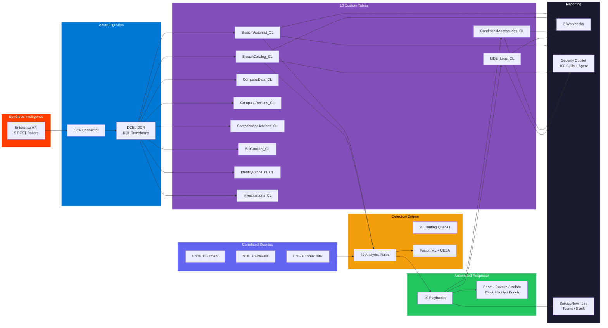

<div align="center">

<picture>
  <source media="(prefers-color-scheme: dark)" srcset="docs/images/spycloud-wordmark-white.png">
  <source media="(prefers-color-scheme: light)" srcset="docs/images/spycloud-wordmark-black.png">
  
</picture>

<br><br>

# SpyCloud Sentinel Supreme

### Darknet Identity Threat Intelligence for Microsoft Sentinel

**Recaptured credentials. Stolen cookies. Infected devices.**
**Detected in minutes — remediated automatically.**

<br>

[](https://portal.azure.com/#create/Microsoft.Template/uri/https%3A%2F%2Fraw.githubusercontent.com%2Fiammrherb%2FSPYCLOUD-SENTINEL%2Fmain%2Fazuredeploy.json/createUIDefinitionUri/https%3A%2F%2Fraw.githubusercontent.com%2Fiammrherb%2FSPYCLOUD-SENTINEL%2Fmain%2FcreateUiDefinition.json)

<br>


</div>

---

## Table of Contents

- [Architecture](#architecture)
- [One-Click Deploy](#one-click-deploy)
- [Cloud Shell Quick Start](#cloud-shell-quick-start)
- [GitHub Actions CI/CD](#github-actions-cicd)
- [What's Included](#whats-included)
- [Features at a Glance](#features-at-a-glance)
- [Configuration Reference](#configuration-reference)
- [Post-Deployment Steps](#post-deployment-steps)
- [Workbooks Gallery](#workbooks-gallery)
- [Security Copilot Integration](#security-copilot-integration)
- [Terraform Alternative](#terraform-alternative)
- [Troubleshooting](#troubleshooting)
- [Contributing](#contributing)
- [License](#license)

---

## Architecture

```
                                  SpyCloud Sentinel -- Darknet & Identity Threat Exposure Intelligence
 _______________________________________________________________________________

  +---------------------+       +------------------------+       +--------------------+
  |                     |       |                        |       |                    |
  |   SpyCloud          |       |   Azure Ingestion      |       |   Custom Tables    |
  |   Enterprise API    +------>+                        +------>+                    |
  |                     |       |   CCF Connector         |       |   BreachWatchlist  |
  |   9 REST Pollers    |       |   DCE / DCR             |       |   BreachCatalog    |
  |   - Breach Watch    |       |   KQL Transforms        |       |   CompassData      |
  |   - Breach Catalog  |       |                        |       |   CompassDevices   |
  |   - Compass Data    |       +------------------------+       |   CompassApps      |
  |   - Compass Devices |                                        |   SipCookies       |
  |   - Compass Apps    |                                        |   IdentityExposure |
  |   - SIP Cookies     |                                        |   Investigations   |
  |   - Identity Expose |                                        |   CA Logs          |
  |   - Investigations  |                                        |   MDE Logs         |
  +---------------------+                                        +---------+----------+
                                                                           |
                          +------------------------------------------------+
                          |
              +-----------v-----------+       +------------------------+
              |                       |       |                        |
              |   Detection Engine    |       |   Correlated Sources   |
              |                       +<------+                        |
              |   49 Analytics Rules  |       |   Entra ID + O365     |
              |   28 Hunting Queries  |       |   MDE + Firewalls     |
              |   Fusion ML + UEBA   |       |   DNS + Threat Intel   |
              |                       |       |   UEBA + Anomalies    |
              +-----------+-----------+       +------------------------+
                          |
              +-----------v-----------+       +------------------------+
              |                       |       |                        |
              |   Automated Response  +------>+   Reporting            |
              |                       |       |                        |
              |   10 Playbooks        |       |   3 Workbooks          |
              |   - Reset / Revoke    |       |   168 Copilot Skills  |
              |   - Isolate / Block   |       |   ServiceNow / Jira   |
              |   - Notify / Enrich   |       |   Teams / Slack       |
              |                       |       |                        |
              +-----------------------+       +------------------------+
```

<details>
<summary><strong>View Mermaid diagram (renders on GitHub)</strong></summary>



</details>

---

## One-Click Deploy

Deploy the complete solution -- connector, tables, rules, playbooks, and workbooks -- in a single operation with a guided 8-step wizard.

<div align="center">

| Cloud | Button |
|:------|:------:|
| **Azure Public** | [](https://portal.azure.com/#create/Microsoft.Template/uri/https%3A%2F%2Fraw.githubusercontent.com%2Fiammrherb%2FSPYCLOUD-SENTINEL%2Fmain%2Fazuredeploy.json/createUIDefinitionUri/https%3A%2F%2Fraw.githubusercontent.com%2Fiammrherb%2FSPYCLOUD-SENTINEL%2Fmain%2FcreateUiDefinition.json) |
| **Azure Government** | [](https://portal.azure.us/#create/Microsoft.Template/uri/https%3A%2F%2Fraw.githubusercontent.com%2Fiammrherb%2FSPYCLOUD-SENTINEL%2Fmain%2Fazuredeploy.json/createUIDefinitionUri/https%3A%2F%2Fraw.githubusercontent.com%2Fiammrherb%2FSPYCLOUD-SENTINEL%2Fmain%2FcreateUiDefinition.json) |

</div>

---

## Cloud Shell Quick Start

[](https://shell.azure.com)

**Option A -- One-liner deploy:**

```bash
curl -sL https://raw.githubusercontent.com/iammrherb/SPYCLOUD-SENTINEL/main/scripts/deploy-all.sh | bash
```

**Option B -- Clone and deploy with parameters:**

```bash
git clone https://github.com/iammrherb/SPYCLOUD-SENTINEL.git
cd SPYCLOUD-SENTINEL

az deployment group create \
  --resource-group "rg-spycloud-sentinel" \
  --template-file azuredeploy.json \
  --parameters \
      workspace="law-spycloud-sentinel" \
      createNewWorkspace=true \
      spycloudApiKey="YOUR_API_KEY" \
      deploymentRegion="eastus" \
      enableMdePlaybook=true \
      enableCaPlaybook=true \
      enableAnalyticsRulesLibrary=true
```

**Option C -- Full scripted deploy with post-config:**

```bash
./scripts/deploy-all.sh \
  -g rg-spycloud-sentinel \
  -w law-spycloud-sentinel \
  -k YOUR_API_KEY \
  -l eastus \
  --non-interactive
```

---

## GitHub Actions CI/CD

[](https://github.com/iammrherb/SPYCLOUD-SENTINEL/actions/workflows/deploy.yml)

The repo includes a production-ready GitHub Actions workflow at [`.github/workflows/deploy.yml`](.github/workflows/deploy.yml). It runs three stages:

1. **Validate** -- ARM template validation against the target resource group
2. **Deploy** -- Full infrastructure deployment with configurable parameters
3. **Configure** -- Post-deploy DCE/DCR resolution, RBAC assignment, and verification

<details>
<summary><strong>Required GitHub Secrets</strong></summary>

| Secret | Description |
|--------|-------------|
| `AZURE_CREDENTIALS` | Service principal credentials JSON |
| `SPYCLOUD_API_KEY` | SpyCloud Enterprise API key |
| `RESOURCE_GROUP` | Target resource group name |
| `WORKSPACE_NAME` | Log Analytics workspace name |

</details>

<details>
<summary><strong>Trigger options</strong></summary>

The workflow supports `workflow_dispatch` with inputs for resource group, workspace, region, and toggles for each component (MDE playbook, CA playbook, analytics rules library, TI enrichment, etc.).

```bash
gh workflow run deploy.yml \
  -f resource_group=rg-spycloud \
  -f workspace=law-spycloud \
  -f location=eastus \
  -f enable_rules_library=true
```

</details>

---

## What's Included

<div align="center">

| Component | Count | Description |
|:---------:|:-----:|-------------|
| **Analytics Rules** | 49 | Scheduled, Fusion ML, NRT, and MSIC rules across 5 categories |
| **Playbooks** | 10 | Logic App workflows with managed identity for automated response |
| **Workbooks** | 3 | Executive, Threat Intel, and SOC Operations dashboards |
| **Hunting Queries** | 28 | KQL queries for proactive threat hunting |
| **Copilot Skills** | 168 | 90 KQL skills + 20 API skills + 58 agent skills |
| **Copilot Agent** | 1 | Interactive autonomous investigation agent with 17 sub-agents |
| **Custom Tables** | 10 | Dedicated Log Analytics tables for SpyCloud data (6 API-sourced + 2 internal + 2 remediation logs) |
| **API Pollers** | 9 | CCF connector streams: Breach Watchlist, Breach Catalog, Compass Data/Devices/Applications, SIP Cookies, Identity Exposure, Investigations, and Malware Records |
| **Notebooks** | 3 | Incident triage, threat hunting, and threat landscape analysis |

</div>

<details>
<summary><strong>10 Playbooks -- full list</strong></summary>

| Playbook | Category | What It Does |
|----------|:--------:|--------------|
| **ForcePasswordReset** | Identity | Forces password change with next-login MFA prompt |
| **RevokeSessions** | Identity | Immediately invalidates all active sign-in sessions |
| **EnforceMFA** | Identity | Deletes existing MFA methods, forces re-registration |
| **BlockConditionalAccess** | Access | Assigns user to severity-tiered Conditional Access group |
| **BlockFirewall** | Network | Pushes block rules to Fortinet / Palo Alto |
| **IsolateDevice** | Device | MDE full or selective isolation based on severity |
| **NotifyUser** | Notify | Emails user with breach details and required actions |
| **NotifySOC** | Notify | Teams Adaptive Card to SOC channel with action buttons |
| **EnrichIncident** | Enrich | Adds SpyCloud context, tags, and severity to incident |
| **FullRemediation** | Orchestration | Chains all playbooks in 3 phased stages |

</details>

<details>
<summary><strong>49 Analytics Rules -- all categories</strong></summary>

| Category | Rules | Data Sources Required |
|----------|:-----:|----------------------|
| Core SpyCloud Detection | 12 | SpyCloud tables only |
| O365 & Entra ID Correlation | 10 | SigninLogs, AuditLogs, OfficeActivity |
| UEBA & Firewall Correlation | 10 | BehaviorAnalytics, CommonSecurityLog, DnsEvents |
| Advanced Threat Detection | 10 | Multi-stage, conditional access, geographic, tool detection |
| Microsoft Security (MSIC) + Fusion | 6 | Defender XDR, Entra Protection, Fusion ML |

**Highlights:**

| ID | Rule | Severity |
|:--:|------|:--------:|
| sc-001 | Infostealer Credential Exposure (severity >= 20) | High |
| sc-003 | Session Cookie Theft / MFA Bypass (severity 25) | High |
| sc-005 | Executive / VIP User Credential Exposure | High |
| sc-020 | Exposed Credential + Successful Sign-in | High |
| sc-022 | Exposed User + Impossible Travel | High |
| sc-035 | DNS C2 Communication from Infected Device | High |
| sc-040 | Multi-Stage Attack Chain | High |
| sc-047 | Credential Theft Tool Detection | High |
| Fusion | Multi-Stage ML Attack Detection | High |

All 49 rules are **enabled by default** and deploy with a single click.

</details>

<details>
<summary><strong>28 Hunting Queries</strong></summary>

Proactive KQL hunting queries covering:

- Stale credential exposures without remediation
- Credential reuse across multiple domains
- Device reinfection patterns
- Anomalous login behavior from exposed users
- Password quality analysis on exposed credentials
- Geographic anomalies between exposure location and sign-in location
- Malware family trend analysis
- Exposed VIP/executive accounts

Deployed via the `hunting-queries.json` template.

</details>

<details>
<summary><strong>3 Notebooks</strong></summary>

| Notebook | Purpose |
|----------|---------|
| `SpyCloud-Incident-Triage.ipynb` | Guided investigation for SpyCloud incidents with enrichment, timeline reconstruction, and remediation recommendations |
| `SpyCloud-ThreatHunting.ipynb` | 8 proactive threat hunting scenarios covering credential reuse, device reinfection, lateral movement, and session hijacking |
| `SpyCloud-Threat-Landscape.ipynb` | Organizational threat landscape analysis with exposure trends, malware family breakdowns, and risk scoring |

</details>

---

## Features at a Glance

| Feature | Status | Details |
|---------|:------:|---------|
| One-click ARM deployment | **Yes** | Guided 8-step wizard via `createUiDefinition.json` |
| Azure Government support | **Yes** | Full GovCloud compatibility |
| Codeless Connector Framework (CCF) | **Yes** | Native Sentinel data connector -- no Azure Functions required |
| KQL data transforms at ingestion | **Yes** | DCR-based normalization before data hits tables |
| Automated remediation | **Yes** | Password reset, session revoke, MFA re-enroll, device isolation |
| Conditional Access integration | **Yes** | Auto-assign exposed users to CA policy groups |
| Firewall integration | **Yes** | Fortinet + Palo Alto block rules |
| UEBA correlation | **Yes** | Cross-reference exposures with behavioral anomalies |
| Fusion ML multi-stage detection | **Yes** | Patented ML correlates low-fidelity signals into high-confidence incidents |
| Security Copilot integration | **Yes** | 267 skills (138 KQL plugin + 129 agent) + GPT-4.1 investigation agent |
| Terraform module | **Yes** | Full IaC alternative in `terraform/` |
| GitHub Actions CI/CD | **Yes** | Validate + Deploy + Configure pipeline |
| ServiceNow / Jira ticketing | **Yes** | Automatic ticket creation from playbooks |
| Teams / Slack notifications | **Yes** | Real-time SOC alerts via webhooks |
| VirusTotal / AbuseIPDB enrichment | **Yes** | TI enrichment playbook with free-tier support |
| Custom data retention | **Yes** | 30 to 730 days configurable per compliance needs |
| Third-party IdP support | **Yes** | Okta, Duo, Ping Identity, CyberArk correlation rules |

---

## Configuration Reference

All parameters for `azuredeploy.json`:

<details>
<summary><strong>Core Parameters</strong></summary>

| Parameter | Type | Default | Description |
|-----------|:----:|---------|-------------|
| `workspace` | string | *(required)* | Name of the Log Analytics workspace for Sentinel |
| `deploymentRegion` | string | Resource group location | Primary Azure region for all resources |
| `workspaceRegionOverride` | string | `""` | Override workspace region if different from deployment region |
| `subscription` | string | Current subscription | Azure Subscription ID (auto-detected) |
| `resourceGroupName` | string | Current RG | Resource group containing the Sentinel workspace |
| `createNewWorkspace` | bool | `true` | Create new workspace + enable Sentinel, or use existing |
| `workspacePricingTier` | string | `PerGB2018` | Pricing tier: PerGB2018, CapacityReservation, Free, etc. |

</details>

<details>
<summary><strong>Data Ingestion Parameters</strong></summary>

| Parameter | Type | Default | Description |
|-----------|:----:|---------|-------------|
| `dataCollectionEndpointName` | string | `dce-spycloud-{workspace}` | Name for the DCE ingestion endpoint |
| `dataCollectionRuleName` | string | `dcr-spycloud-{workspace}` | Name for the DCR transform/routing rule |
| `retentionInDays` | int | `90` | Data retention: 30, 60, 90, 180, 365, or 730 days |
| `networkAccessMode` | string | `Enabled` | DCE public access: Enabled or Disabled (Private Link) |
| `dceLogsIngestionUri` | string | `""` | Leave blank on first deploy; resolved by post-deploy script |
| `dcrImmutableId` | string | `""` | Leave blank on first deploy; resolved by post-deploy script |

</details>

<details>
<summary><strong>Playbook & Detection Parameters</strong></summary>

| Parameter | Type | Default | Description |
|-----------|:----:|---------|-------------|
| `enableMdePlaybook` | bool | `true` | Deploy MDE device isolation playbook |
| `enableCaPlaybook` | bool | `true` | Deploy Conditional Access identity protection playbook |
| `enableAnalyticsRule` | bool | `true` | Deploy core infostealer detection analytics rule |
| `enableAutomationRule` | bool | `true` | Connect analytics rule to playbooks for auto-remediation |
| `enableAnalyticsRulesLibrary` | bool | `true` | Deploy full library of 49 analytics rules |
| `enableSessionCookieDetection` | bool | `true` | Rules for stolen session cookies / MFA bypass (severity 25) |
| `enableIdentityProviderAlerts` | bool | `true` | IdP correlation rules (Okta, Duo, Ping, CyberArk) |
| `enableCredResponsePlaybook` | bool | `true` | Credential response: password reset + Teams alert |
| `enableMdeBlocklistPlaybook` | bool | `true` | Scheduled MDE blocklist scan for severity 25 matches |
| `enableWorkbook` | bool | `true` | Deploy Threat Intelligence Dashboard workbook |
| `enableUEBA` | bool | `true` | Enable User and Entity Behavior Analytics |
| `enableAnomalies` | bool | `true` | Enable ML-powered anomaly detection rules |
| `enableFusionRule` | bool | `true` | Deploy Fusion multi-stage ML attack detection |
| `enableMicrosoftSecurityIncidentRules` | bool | `true` | MSIC rules for Defender XDR, Entra Protection, etc. |
| `enableTiEnrichmentPlaybook` | bool | `true` | VirusTotal / AbuseIPDB / GreyNoise enrichment |
| `enableNotifications` | bool | `true` | Azure Monitor Action Group for alerts |
| `enablePostDeployScript` | bool | `true` | Run automated post-deploy configuration |

</details>

<details>
<summary><strong>Tuning & Integration Parameters</strong></summary>

| Parameter | Type | Default | Description |
|-----------|:----:|---------|-------------|
| `spycloudSeverityThreshold` | int | `20` | Minimum severity to trigger remediation (2, 5, 20, or 25) |
| `analyticsRuleSeverity` | string | `High` | Sentinel incident severity (High, Medium, Low, Informational) |
| `analyticsRuleFrequency` | string | `PT1H` | Rule run frequency (PT5M to PT24H) |
| `mdeIsolationType` | string | `Full` | Device isolation type: Full or Selective |
| `mdeTagName` | string | `SpyCloud-Compromised` | Tag applied to compromised devices in MDE |
| `mdeBlocklistScheduleHours` | int | `4` | MDE blocklist scan interval (1-24 hours) |
| `caSecurityGroupId` | string | `""` | Entra ID security group for CA policy assignment |
| `notificationEmail` | string | `""` | Email for alert notifications |
| `teamsWebhookUrl` | string | `""` | Teams incoming webhook for alerts |
| `teamsChannelWebhook` | string | `""` | Teams webhook for SOC alert channel |
| `serviceNowInstance` | string | `""` | ServiceNow instance URL for ticket creation |
| `virusTotalApiKey` | securestring | `""` | VirusTotal API key for TI enrichment |
| `resourceTags` | object | solution/version/deployedBy | Azure tags applied to all resources |
| `tagEnvironment` | string | `production` | Environment tag (production, staging, dev, test, poc) |
| `tagOwner` | string | `""` | Owner tag for resource governance |

</details>

---

## Post-Deployment Steps

The post-deploy script automates most configuration. Run it once after deployment:

```bash
# Automated: grants permissions, configures RBAC, validates everything
./scripts/post-deploy-auto.sh -g YOUR_RESOURCE_GROUP -w YOUR_WORKSPACE

# Verify: checks all components (tables, connector, rules, playbooks, data flow)
./scripts/verify-deployment.sh -g YOUR_RESOURCE_GROUP -w YOUR_WORKSPACE
```

### Checklist

| # | Task | Automated? |
|:-:|------|:----------:|
| 1 | Grant managed identity API permissions (Graph, MDE) | Yes |
| 2 | Assign RBAC roles (Sentinel Responder, Monitoring Metrics Publisher) | Yes |
| 3 | Resolve DCE/DCR endpoints and configure connector | Yes |
| 4 | Verify data ingestion in custom tables (allow 15 min) | Yes |
| 5 | Confirm analytics rules are firing (check Incidents blade) | Yes |
| 6 | Populate VIP Watchlist with executive/admin emails | Manual |
| 7 | Configure ticketing integration (ServiceNow / Jira) | Optional |
| 8 | Set up notification channels (Teams / Slack / Email) | Optional |

<details>
<summary><strong>Required Azure RBAC Roles</strong></summary>

The deploying user/service principal needs:

- Sentinel Contributor
- Log Analytics Contributor
- Logic App Contributor
- Managed Identity Operator
- Sentinel Automation Contributor

**Network requirements:** Outbound HTTPS (443) to `api.spycloud.io` -- no inbound rules needed.

</details>

<details>
<summary><strong>Playbook API Permissions (auto-granted by post-deploy script)</strong></summary>

| Playbook | API Permission |
|----------|---------------|
| ForcePasswordReset / RevokeSessions | `User.ReadWrite.All` |
| EnforceMFA | `UserAuthenticationMethod.ReadWrite.All` |
| BlockConditionalAccess | `GroupMember.ReadWrite.All` |
| IsolateDevice | `Machine.Isolate` (MDE) |
| NotifyUser | `Mail.Send` |
| EnrichIncident | Sentinel Responder role |

</details>

---

## Workbooks Gallery

Three purpose-built workbooks provide visibility across the full exposure lifecycle:

| Workbook | Audience | What It Shows |
|----------|----------|---------------|
| **Executive Dashboard** | CISOs, leadership | Exposure summary, risk posture over time, SLA compliance, remediation rates, breach source breakdown, organizational risk score |
| **Threat Intel Dashboard** | Threat intel analysts | Malware family trends, breach catalog deep-dive, geographic distribution, severity heatmaps, infostealer vs. traditional breach comparison, password quality analysis |
| **SOC Operations** | SOC analysts, IR teams | Active incidents queue, playbook execution status, remediation timeline, mean-time-to-respond, per-user exposure history, device isolation status, UEBA correlation view |

All workbooks are deployed via the ARM template when `enableWorkbook` is set to `true` (default). They are available in **Sentinel > Workbooks > My workbooks** immediately after deployment.

---

## Security Copilot Integration

SpyCloud Sentinel v13.0 includes **six Security Copilot integrations** in the unified `copilot/` directory — featuring **SCORCH** (SpyCloud Compromised Operations Research & Credential Hunter), a grumpy, sarcastic, brilliantly overworked SOC analyst personality with 400+ skills, 54 API endpoints, Logic App remediation actions, and MCP server architecture.

> **New in v13.0:** SCORCH personality (grumpy SOC analyst persona), Full API Suite plugin covering all 8 SpyCloud API products (54 endpoints, up from 9), Logic App plugin for remediation actions from Copilot, MCP server architecture design, 150+ prompt library, MITRE ATT&CK mapping, exhaustive research capabilities, compliance evidence generation, and executive briefing skills. [Read the full evaluation](docs/SCORCH-AGENT-EVALUATION-v13.md).

<details>
<summary><strong>All files in <code>copilot/</code></strong></summary>

| File | Type | Skills | Description |
|------|:----:|:------:|-------------|
| `SpyCloud_Plugin.yaml` | KQL Plugin | 90 | Promptbook skills querying 10 Sentinel custom tables plus 20+ native Microsoft tables for user investigation, device forensics, breach catalog, UEBA correlation, remediation audit, connector health, executive reporting |
| `SpyCloud_Agent.yaml` | Agent | 26 sub-agents | **SCORCH** — autonomous interactive investigation agent with grumpy SOC analyst personality. Orchestrates 26 sub-agents across 11 Microsoft security products with MITRE ATT&CK mapping and exhaustive research |
| `SpyCloud_API_Plugin.yaml` | API Plugin | 20 | Direct REST API skills calling SpyCloud Enterprise, Compass, Identity Exposure, SIP, and Investigations APIs |
| `SpyCloud_FullAPI_Plugin.yaml` | API Plugin | 54 | **NEW** — Complete SpyCloud API Suite covering all 8 products: Enterprise, Compass, SIP, CAP, Investigations, IdLink, Exposure Metrics, NIST Password Check, Credit Cards, Data Partnership |
| `SpyCloud_FullAPI_OpenAPI.yaml` | OpenAPI Spec | -- | OpenAPI 3.0 specification for the Full API Suite (54 endpoints) |
| `SpyCloud_API_Plugin_OpenAPI.yaml` | OpenAPI Spec | -- | OpenAPI 3.0 specification for the original API Plugin |
| `SpyCloud_LogicApp_Plugin.yaml` | LogicApp Plugin | 8 | **NEW** — Invokable Logic App skills for enrichment + remediation actions directly from Security Copilot. Includes MCP server architecture design |
| `SCORCH_Prompt_Library.md` | Prompt Library | 150+ | **NEW** — Categorized prompt catalog across 12 investigation types with complexity tiers and persona mapping |
| `manifest.json` | OpenAI | -- | Plugin manifest for OpenAI-compatible hosts |

</details>

<details>
<summary><strong>What's the difference between Agents, Plugins, and Logic App Skills?</strong></summary>

| Feature | KQL Plugin | API Plugin | Logic App Plugin | Agent |
|---------|-----------|-----------|-----------------|-------|
| **Nature** | Discrete KQL skills | REST API calls | Orchestrated actions | Conversational AI |
| **Data Source** | Sentinel tables | Live SpyCloud API | API + Sentinel + Graph | All of the above |
| **Memory** | Stateless | Stateless | Stateless | Context across conversation |
| **Chaining** | Manual | Manual | Manual | Automatic — chains intelligently |
| **Actions** | Read-only queries | Read-only lookups | Read + Write (remediate) | Read + orchestrate |
| **Personality** | None | None | None | SCORCH — grumpy, brilliant, thorough |
| **Use case** | Promptbooks, quick lookups | Real-time enrichment | Device isolation, password reset | Full investigations, reporting |

**Use all together for maximum coverage.** The SCORCH agent orchestrates KQL skills internally, and analysts can invoke API and Logic App skills directly or let the agent call them.

</details>

**Example SCORCH prompts:**

- "Show me an overview of our dark web exposure — hit me with the bad news"
- "Investigate john.doe@company.com — full exposure report"
- "Which users have the most critical credential exposures right now?"
- "Are any devices infected with infostealer malware?"
- "What stolen session cookies could bypass our MFA?"
- "Do we have sensitive PII exposed requiring breach notification?"
- "Run a full threat hunt across all our exposure data"
- "Draft an executive summary for leadership with severity and trends"
- "What would an attacker's kill chain look like with this data?"
- "Research the Lumma Stealer — TTPs, C2, recent campaigns"

<details>
<summary><strong>Setup</strong></summary>

**KQL Plugin (queries Sentinel tables — no API key needed):**

1. Navigate to **Security Copilot > Settings > Plugins > Add Plugin**
2. Upload `copilot/SpyCloud_Plugin.yaml`
3. Enter your Tenant ID, Subscription ID, Resource Group, and Workspace Name
4. 90 KQL skills become available in promptbooks and standalone prompts

**Full API Plugin (all 8 SpyCloud API products):**

1. Upload `copilot/SpyCloud_FullAPI_Plugin.yaml`
2. Enter your SpyCloud Enterprise API key when prompted (sent as `X-Api-Key` header)
3. 54 REST API skills for real-time lookups across all SpyCloud products
4. Skills are available based on your SpyCloud license (graceful degradation for unlicensed products)

**Logic App Plugin (remediation actions from Copilot):**

1. Deploy the SpyCloud Logic Apps via the ARM template (playbooks must be deployed first)
2. Upload `copilot/SpyCloud_LogicApp_Plugin.yaml`
3. Enter your Subscription ID and Resource Group
4. 8 action skills: email/domain/IP enrichment, device isolation, password reset, SOC notification, full investigation

**SCORCH Investigation Agent (autonomous interactive triage):**

1. Upload `copilot/SpyCloud_Agent.yaml`
2. Configure the same Sentinel workspace settings
3. Find SCORCH in **Agents** and start chatting
4. Use the 150+ prompt library (`copilot/SCORCH_Prompt_Library.md`) for investigation ideas

All three integrations work together -- the KQL plugin queries historical Sentinel data, the API plugin pulls real-time data from SpyCloud, and the agent orchestrates complex investigations across both. The agent proactively identifies missing connectors and generates admin-ready recommendations.

**For detailed setup instructions, role-based use cases, and optimization tips, see the [Agents & Plugins Guide](docs/AGENTS-AND-PLUGINS-GUIDE.md).**

</details>

---

## Terraform Alternative

A full Terraform module is available in the [`terraform/`](terraform/) directory for teams that prefer infrastructure-as-code.

```bash
cd terraform

# Configure
cp terraform.tfvars.example terraform.tfvars
# Edit terraform.tfvars with your values

# Set API key via environment variable (never commit secrets)
export TF_VAR_spycloud_api_key="your-api-key"

# Deploy
terraform init
terraform plan
terraform apply
```

<details>
<summary><strong>Example terraform.tfvars</strong></summary>

```hcl
subscription_id        = "00000000-0000-0000-0000-000000000000"
resource_group_name    = "rg-spycloud-sentinel"
location               = "eastus"
workspace_name         = "law-spycloud-sentinel"
create_new_workspace   = true
enable_mde_playbook    = true
enable_ca_playbook     = true
enable_key_vault       = true
enable_analytics_rules = true
```

</details>

The Terraform module manages the same resources as the ARM template with full `plan`/`apply`/`destroy` lifecycle support.

---

## Troubleshooting

<details>
<summary><strong>No data appearing in custom tables</strong></summary>

1. **Wait 15 minutes** after deployment for the first polling cycle to complete.
2. Verify the DCE and DCR were resolved:
   ```bash
   az monitor data-collection endpoint show \
     --name "dce-spycloud-YOUR_WORKSPACE" \
     --resource-group YOUR_RG \
     --query "logsIngestion.endpoint" -o tsv
   ```
3. Check connector health in **Sentinel > Data connectors > SpyCloud**.
4. Verify your SpyCloud API key is valid and has the correct permissions at [portal.spycloud.com](https://portal.spycloud.com).
5. Re-run the post-deploy script: `./scripts/post-deploy-auto.sh -g YOUR_RG -w YOUR_WS`

</details>

<details>
<summary><strong>Playbooks not triggering on incidents</strong></summary>

1. Verify the automation rule is enabled in **Sentinel > Automation**.
2. Check that the managed identity has the required API permissions:
   ```bash
   ./scripts/grant-permissions.sh -g YOUR_RG -w YOUR_WORKSPACE
   ```
3. Ensure admin consent was granted for Graph API permissions in Entra ID > Enterprise applications.
4. Check Logic App run history for specific error details.

</details>

<details>
<summary><strong>ARM deployment fails with region error</strong></summary>

The DCE/DCR must deploy to the same region as your Log Analytics workspace. If your workspace is in a different region than the resource group, set the `workspaceRegionOverride` parameter to your workspace's region.

</details>

<details>
<summary><strong>"Monitoring Metrics Publisher" RBAC error</strong></summary>

The post-deploy script assigns this role automatically. If it fails:

```bash
# Get the Logic App managed identity principal ID
PID=$(az logic workflow show --name "SpyCloud-MDE-Remediation-YOUR_WS" \
  -g YOUR_RG --query "identity.principalId" -o tsv)

# Get the DCR resource ID
DCR_ID=$(az monitor data-collection rule show \
  --name "dcr-spycloud-YOUR_WS" -g YOUR_RG --query "id" -o tsv)

# Assign the role
az role assignment create \
  --assignee-object-id "$PID" \
  --assignee-principal-type ServicePrincipal \
  --role "3913510d-42f4-4e42-8a64-420c390055eb" \
  --scope "$DCR_ID"
```

</details>

<details>
<summary><strong>Cleanup / uninstall</strong></summary>

```bash
# Remove all SpyCloud resources (preserves workspace)
./scripts/cleanup-tables.sh -g YOUR_RG -w YOUR_WORKSPACE

# Or delete the entire resource group
az group delete --name YOUR_RG --yes
```

</details>

---

## Contributing

Contributions are welcome. To get started:

1. **Fork** the repository
2. **Create a feature branch:** `git checkout -b feature/my-improvement`
3. **Make your changes** -- ensure ARM templates validate with `az deployment group validate`
4. **Test** your deployment against a non-production Sentinel workspace
5. **Submit a pull request** with a clear description of the change

**Guidelines:**

- Analytics rules should include a severity level and mapping to MITRE ATT&CK techniques where applicable
- Playbooks must use system-assigned managed identities (no shared credentials)
- All KQL queries should be tested against the custom table schemas defined in the ARM template
- Follow existing naming conventions: `SpyCloud-{ComponentName}`

For bugs and feature requests, open an [issue](https://github.com/iammrherb/SPYCLOUD-SENTINEL/issues).

---

## License

This project is licensed under the **MIT License**. See [LICENSE](LICENSE) for the full text.

---

<div align="center">


<br>

**SpyCloud Sentinel** -- Built on SpyCloud intelligence and Microsoft Sentinel.

Protecting organizations from the consequences of stolen credentials.

<br>

[](https://github.com/iammrherb/SPYCLOUD-SENTINEL/issues)
&nbsp;
[](mailto:support@spycloud.com)
&nbsp;
[](https://learn.microsoft.com/azure/sentinel)

</div>
