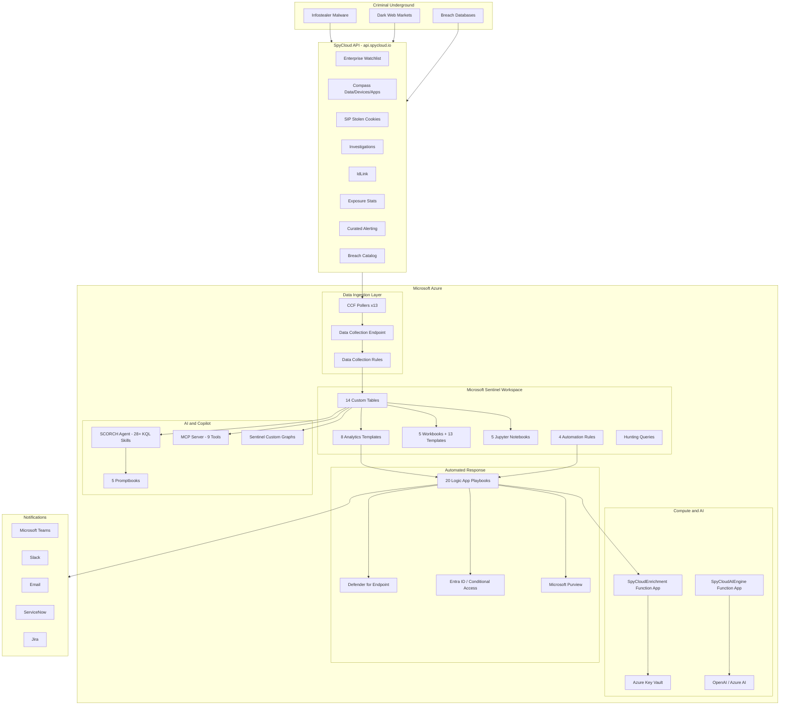
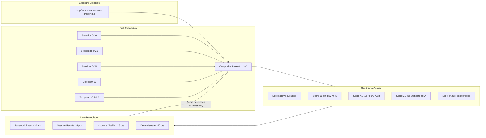
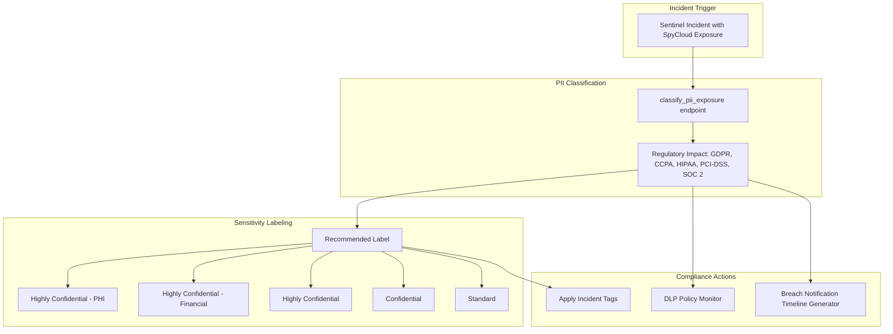
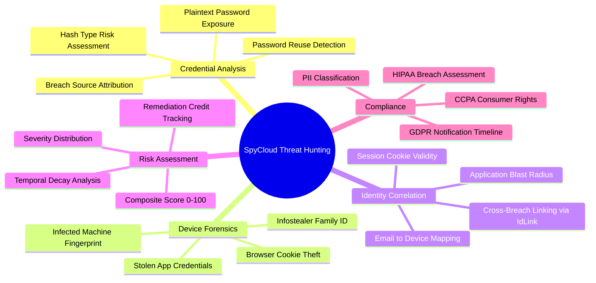

<div align="center">


# SpyCloud Identity Exposure Intelligence for Sentinel v2.0.0

### The Most Comprehensive Darknet Identity Threat Intelligence Platform for Microsoft Sentinel

[](#) [](#playbooks) [](#analytics-rules) [](#workbooks--dashboards) [](#notebooks--graph-integration) [](#scorch--the-autonomous-security-agent) [](#option-4-deploy-via-terraform)

**20 playbooks** | **5 workbooks + 13 templates** | **8 analytics templates** | **23 playbook templates** | **4 automation templates** | **5 notebooks** | **5 promptbooks** | **MCP server** | **Terraform module** | **Unified toolkit**

---

*When infostealers strike, SpyCloud knows what was stolen -- and this solution makes sure you act on it before the attackers do.*

</div>

---

## Table of Contents

- [Why SpyCloud?](#why-spycloud-identity-exposure-intelligence)
- [Architecture](#architecture)
- [Quick Start](#quick-start)
- [Deployment Options](#deployment-options)
- [Post-Deployment Setup](#post-deployment-setup)
- [Prerequisites & Permissions](#prerequisites--permissions)
- [SpyCloud API & Severity Levels](#spycloud-api--severity-levels)
- [Analytics Rules](#analytics-rules)
- [Playbooks](#playbooks)
- [SCORCH Agent](#scorch--the-autonomous-security-agent)
- [Security Copilot & Defender Portal](#security-copilot--defender-portal)
- [MCP Server](#mcp-server)
- [Notebooks & Graph Integration](#notebooks--graph-integration)
- [Workbooks & Dashboards](#workbooks--dashboards)
- [Toolkit](#spycloud-toolkit)
- [Purple Team Testing](#purple-team-testing--benchmarking)
- [CI/CD & GitHub Actions](#cicd--github-actions)
- [Cost Optimization](#cost-optimization)
- [Troubleshooting](#troubleshooting)
- [Use Cases](#use-cases)
- [Licensing](#licensing)
- [ISV & Marketplace Readiness](#isv--marketplace-readiness)
- [Documentation](#documentation)
- [Support](#support)

---

## Why SpyCloud Identity Exposure Intelligence?

Every 39 seconds, an infostealer malware infection steals an employee's credentials, session cookies, browser autofill, VPN tokens, and SSO sessions. Traditional EDR might catch the malware. **SpyCloud tells you exactly what was stolen and from whom** -- hours after exposure, straight from the criminal underground.

### What Sets This Apart

| Traditional Approach | SpyCloud Identity Exposure Intelligence |
|:---|:---|
| Alert on suspicious sign-ins | Know **which credentials are stolen** before they are used |
| Detect anomalies after the fact | **Quantify identity risk** with a 0-100 composite score |
| Require manual investigation | **Auto-remediate** -- isolate devices, reset passwords, revoke sessions |
| Generic threat intel feeds | **Device-specific forensics** -- exactly which apps, cookies, and tokens were stolen |
| Basic playbooks | **20 playbooks** with autonomous AI agent investigation |
| Static dashboards | **5 workbooks + 13 per-table templates** for SOC, executives, IR, and threat intel |
| Simple API lookups | **17-endpoint Function App** with Key Vault integration and risk scoring |
| No AI integration | **SCORCH Agent** -- autonomous Security Copilot AI that investigates, scores, and recommends |

### Key Capabilities

- **Darknet Intelligence Ingestion** -- 14 custom tables via Codeless Connector Framework (CCF) polling
- **Composite Risk Scoring** -- 5-component weighted score (severity, credential, session, device, temporal) from 0-100
- **Closed-Loop Remediation** -- Score decreases automatically when remediation actions execute
- **Cross-Product Fusion** -- Enterprise + Compass + SIP + IdLink correlations for blast radius analysis
- **AI-Powered Investigation** -- OpenAI/Azure AI-driven threat research, executive reports, and remediation plans
- **Purview Compliance** -- PII classification, sensitivity labeling, DLP monitoring, regulatory impact assessment
- **Graph Analysis** -- Sentinel Custom Graphs for exposure perimeter, blast radius, and lateral movement path discovery

---

## Architecture

### High-Level Data Flow



### Identity Risk Score -- Closed-Loop Remediation



### Purview Compliance Flow



### Playbook Response Architecture

```mermaid
flowchart LR
    subgraph TriggerGroup["Detection"]
        INC["Sentinel Incident"]
        ALERT["Analytics Rule Alert"]
        AUTOT["Automation Rule"]
    end

    subgraph Triage["AI Triage"]
        SCORCH_T["SCORCH Agent Risk Assessment"]
        ENRICH["SpyCloud Enrichment API"]
    end

    subgraph RemediateGroup["Automated Response"]
        PWD["Password Reset"]
        SESS["Session Revoke"]
        ISO["Device Isolate"]
        BLOCK["CA Block"]
        DISABLE["Account Disable"]
    end

    subgraph NotifyGroup["Notification"]
        TEAMS_R["Teams"]
        SLACK_R["Slack"]
        EMAIL_R["Email"]
        SNOW_R["ServiceNow"]
        JIRA_R["Jira"]
    end

    INC --> SCORCH_T
    ALERT --> AUTOT --> SCORCH_T
    SCORCH_T --> ENRICH
    ENRICH --> RemediateGroup
    RemediateGroup --> NotifyGroup
```



### Threat Hunting Brain Map



---

## Quick Start

```bash
# 1. Clone the repository
git clone https://github.com/iammrherb/SPYCLOUD-SENTINEL.git
cd SPYCLOUD-SENTINEL

# 2. Deploy to Azure (one-click)
# Click the Deploy to Azure button below, or use Cloud Shell / Terraform

# 3. Run the unified toolkit for health checks
chmod +x scripts/spycloud-toolkit.sh
./scripts/spycloud-toolkit.sh --health-check

# 4. Grant playbook permissions
./scripts/spycloud-toolkit.sh --fix-permissions

# 5. Generate a full deployment report
./scripts/spycloud-toolkit.sh --full-report
```

---

## Deployment Options

### Option 1: Deploy to Azure (Commercial)

[](https://portal.azure.com/#create/Microsoft.Template/uri/https%3A%2F%2Fraw.githubusercontent.com%2Fiammrherb%2FSPYCLOUD-SENTINEL%2Fmain%2Fazuredeploy.json/createUIDefinitionUri/https%3A%2F%2Fraw.githubusercontent.com%2Fiammrherb%2FSPYCLOUD-SENTINEL%2Fmain%2FcreateUiDefinition.json)

> The deployment wizard guides you through all configuration: API keys, severity thresholds, polling intervals, Key Vault settings, App Service, permissions, domain watchlist selection (with Azure AD verified domain lookup), and optional purple team testing.

### Option 2: Deploy to Azure Government

[](https://portal.azure.us/#create/Microsoft.Template/uri/https%3A%2F%2Fraw.githubusercontent.com%2Fiammrherb%2FSPYCLOUD-SENTINEL%2Fmain%2Fazuredeploy.json/createUIDefinitionUri/https%3A%2F%2Fraw.githubusercontent.com%2Fiammrherb%2FSPYCLOUD-SENTINEL%2Fmain%2FcreateUiDefinition.json)

> Supports Azure Government regions: US Gov Virginia, US Gov Arizona, US Gov Texas.

### Option 3: Deploy via Azure Cloud Shell

```bash
git clone https://github.com/iammrherb/SPYCLOUD-SENTINEL.git
cd SPYCLOUD-SENTINEL
chmod +x scripts/deploy-cloudshell.sh
./scripts/deploy-cloudshell.sh
# Or with an answer file for fully automated deployment:
./scripts/deploy-cloudshell.sh --answer-file config.json
```

The Cloud Shell script will:
1. Validate your Azure subscription and permissions
2. Prompt for configuration (or use the answer file)
3. Create the resource group and deploy the ARM template
4. Configure managed identities and RBAC for all playbooks
5. Enable analytics rules and automation rules
6. Run a post-deployment health check and generate a report

### Option 4: Deploy via Terraform

```bash
cd terraform/
terraform init

# Azure Commercial
terraform plan -var="spycloud_api_key=YOUR_KEY" -var="monitored_domain=contoso.com"

# Azure Government
terraform plan -var="spycloud_api_key=YOUR_KEY" -var="monitored_domain=contoso.com" \
  -var="cloud_environment=AzureUSGovernment" -var="location=usgovvirginia"

terraform apply
```

| Variable | Default | Description |
|----------|---------|-------------|
| `spycloud_api_key` | *(required)* | SpyCloud Enterprise API key |
| `monitored_domain` | `""` | Primary corporate domain to monitor |
| `cloud_environment` | `AzureCloud` | `AzureCloud` or `AzureUSGovernment` |
| `location` | `eastus` | Azure region (incl. Gov regions) |
| `severity_threshold` | `2` | Min SpyCloud severity: 2, 5, 20, or 25 |
| `polling_interval` | `4h` | Data polling: 1h, 4h, 8h, 12h, 24h |
| `enable_plaintext_passwords` | `false` | Include plaintext passwords in records |

### Option 5: Content Hub (Marketplace)

1. Navigate to **Microsoft Sentinel** > **Content Hub**
2. Search for **SpyCloud**
3. Click **Install** to deploy the solution package
4. Configure data connector with API keys

> See [ISV & Marketplace Readiness](#isv--marketplace-readiness) for packaging details.

---

## Post-Deployment Setup

### 1. Content Hub Configuration

1. Navigate to **Microsoft Sentinel** > **Content Hub**
2. Search for **SpyCloud** and click **Install**
3. Wait for installation to complete (2-5 minutes)
4. Verify installed items:
   - **Analytics** > **Rule Templates** -- SpyCloud detection rules
   - **Hunting** > **Queries** -- SpyCloud hunting queries
   - **Workbooks** > **Templates** -- SpyCloud workbook templates
   - **Automation** > **Playbook Templates** -- SpyCloud playbook templates

### 2. Data Connector Setup

1. Navigate to **Sentinel** > **Data Connectors**
2. Find **SpyCloud Enterprise Protection** > **Open connector page**
3. Enter your API keys:

| Key | Required | Products Enabled |
|-----|:--------:|-----------------|
| Enterprise API Key | **Yes** | Watchlist, Breach Catalog, core detections |
| Compass API Key | Optional | Application-level credential data |
| SIP API Key | Optional | Stolen session cookies (MFA bypass detection) |
| Investigations API Key | Optional | Full SpyCloud database search |
| IdLink API Key | Optional | Cross-identity correlation |
| Exposure API Key | Optional | Domain-level aggregate metrics |
| CAP API Key | Optional | Curated alerting data |
| Data Partnership API Key | Optional | Partner data feeds |

4. Configure your **monitored domain** -- the deployment wizard provides a dropdown populated from Azure AD verified domains, or enter manually (e.g., `contoso.com`)
5. Set **severity threshold**:

| Level | Description | Recommended For |
|:-----:|------------|-----------------|
| **2** | All breaches including public datasets | Full visibility, higher volume |
| **5** | Combo lists and targeted attacks | Balanced coverage |
| **20** | Infostealer-stolen credentials only | High-fidelity alerts |
| **25** | Infostealers + stolen session cookies | Maximum severity only |

6. Toggle **plaintext password** inclusion (disabled by default for SIEM compliance)
7. Click **Connect** -- data begins flowing within 15-30 minutes

### 3. Analytics Rules

Navigate to **Sentinel** > **Analytics** > **Rule Templates**, filter by source **SpyCloud**, and enable the rules relevant to your environment.

### 4. Playbook Permissions (RBAC)

```bash
# Automated permission grant via toolkit
chmod +x scripts/spycloud-toolkit.sh
./scripts/spycloud-toolkit.sh --fix-permissions
```

> **Managed Identity**: All playbooks use system-assigned managed identity. The deployment creates the identities; you only need to grant API permissions.

---

## Prerequisites & Permissions

### Azure Resource Permissions

| Resource | Required Role | Purpose |
|----------|--------------|---------|
| **Subscription** | Contributor | Deploy ARM template resources |
| **Resource Group** | Owner (or Contributor + User Access Admin) | Assign RBAC to managed identities |
| **Log Analytics Workspace** | Log Analytics Contributor | Create custom tables, DCR/DCE |
| **Microsoft Sentinel** | Microsoft Sentinel Contributor | Enable analytics, automation, workbooks |
| **Key Vault** | Key Vault Administrator | Store and manage API keys |
| **Logic Apps** | Logic App Contributor | Deploy and manage playbooks |
| **Function App** | Website Contributor | Deploy enrichment functions |

### Microsoft Defender for Endpoint (MDE)

1. **License**: Microsoft Defender for Endpoint Plan 2 (P2)
2. **Permissions** for playbook managed identities:
   - `Machine.Isolate` -- Isolate compromised devices
   - `Machine.ReadWrite.All` -- Tag devices, submit IOCs
   - `Alert.ReadWrite.All` -- Create and update alerts
3. **Configuration**:
   - Enable **Advanced Features** > **Allow partner access** in MDE settings
   - Ensure devices are onboarded and reporting to MDE
   - Enable **Automated Investigation and Response** (AIR)

### Microsoft Entra ID & Conditional Access

1. **License**: Entra ID P1 (minimum); P2 for Identity Protection
2. **Required API Permissions**:
   - `User.ReadWrite.All` -- Password reset, account disable
   - `User.RevokeSessions.All` -- Revoke refresh tokens
   - `GroupMember.ReadWrite.All` -- Add users to security groups
   - `Policy.ReadWrite.ConditionalAccess` -- Modify CA policies
   - `Directory.ReadWrite.All` -- Write custom security attributes
3. **Conditional Access Setup**:
   - Create a **Custom Security Attribute** named `SpyCloudRiskScore` (type: Integer)
   - Create CA policies referencing this attribute:
     - Score > 80: Block access except from compliant devices
     - Score 61-80: Require hardware security key
     - Score 41-60: Require re-authentication every hour
     - Score 21-40: Require MFA

### Microsoft Intune

1. Enable **Intune integration** with Defender for Endpoint
2. Create a **compliance policy** marking devices non-compliant when MDE risk level is "High"
3. Configure **remediation actions**: wipe corporate data, require re-enrollment

### Microsoft Purview (Optional)

1. **License**: Microsoft 365 E5 or Purview add-on
2. **Required Permissions**:
   - `InformationProtectionPolicy.Read.All` -- Read sensitivity labels
   - `SecurityIncident.ReadWrite.All` -- Tag incidents
3. **Configuration**:
   - Enable Information Protection in Purview compliance portal
   - Create sensitivity labels: Standard, Confidential, Highly Confidential

### Key Vault Configuration

- Enable **soft delete** and **purge protection** (default in wizard)
- Use **Premium SKU** for HSM-backed keys in production
- Enable **diagnostic logging** to Sentinel workspace
- Restrict **network access** to Function App and Logic Apps only
- Rotate API keys on a 90-day schedule

---

## SpyCloud API & Severity Levels

### Severity Mapping

| Severity | Source Type | Risk Level | Description |
|:--------:|-----------|:----------:|-------------|
| **2** | Public breach data | Low | Credentials from publicly known breaches |
| **5** | Combo lists | Medium | Aggregated credential lists traded on dark web |
| **20** | Infostealer malware | High | Credentials stolen by malware from victim devices |
| **25** | Infostealer + active sessions | Critical | Stolen credentials AND session cookies (MFA bypass) |

### Password Risk Model

| Type | Risk | Score Impact |
|------|:----:|:-----------:|
| Argon2/bcrypt hash | Low | +2 |
| SHA-256/512 hash | Medium | +5 |
| MD5/SHA-1 hash | High | +10 |
| Base64 encoded | High | +15 |
| **Plaintext** | **Critical** | **+25** |

### Custom Tables (14)

| Table | Data Source | Key Fields |
|-------|-----------|------------|
| `SpyCloudBreachWatchlist_CL` | Enterprise Watchlist (new) | email, severity, source_id, password_type |
| `SpyCloudBreachWatchlistModified_CL` | Enterprise Watchlist (modified) | email, severity, modified_date |
| `SpyCloudBreachCatalog_CL` | Breach Catalog | breach_id, title, type, num_records |
| `SpyCloudCompassData_CL` | Compass | target_url, email, domain, application |
| `SpyCloudCompassDevices_CL` | Compass Devices | infected_machine_id, ip_addresses |
| `SpyCloudCompassApplications_CL` | Compass Applications | target_application, credential_count |
| `SpyCloudSipCookies_CL` | SIP Stolen Cookies | cookie_domain, session_valid, expiry |
| `SpyCloudInvestigations_CL` | Investigations API | query, result_count, records |
| `SpyCloudIdLink_CL` | IdLink | identity_chain, linked_accounts |
| `SpyCloudExposure_CL` | Exposure Stats | domain, exposure_count, trend |
| `SpyCloudCAP_CL` | Curated Alerting | alert_type, priority, entity |
| `SpyCloudDataPartnership_CL` | Data Partnership | partner_source, record_type |
| `SpyCloudEnrichmentAudit_CL` | Enrichment Function | endpoint, status, latency |
| `SpyCloudMDE_Logs_CL` | MDE Correlation | device_id, action, result |

---

## Analytics Rules

8 analytics rule templates organized by detection category:

| Template | Category | Description | Severity |
|----------|----------|-------------|:--------:|
| **SpyCloud -- New High-Severity Exposure Detected** | Core Detection | Triggers when new breach records with severity >= 20 are ingested | High |
| **SpyCloud -- Infostealer Credential Theft with Active Session** | Core Detection | Detects severity 25 exposures indicating stolen session cookies | Critical |
| **SpyCloud -- Password Reuse Across Multiple Breaches** | Credential Analysis | Identifies users with same password hash across multiple breach sources | Medium |
| **SpyCloud -- VIP User Exposure Alert** | Identity Protection | Alerts on exposures for users in specified VIP/executive groups | High |
| **SpyCloud -- Compromised Credential Sign-In Correlation** | IdP Correlation | Cross-references exposures with Entra ID sign-in logs for active use | Critical |
| **SpyCloud -- Stolen Cookie MFA Bypass Risk** | Session Security | Detects SIP cookie exposures for domains with active user sessions | Critical |
| **SpyCloud -- Device Infection with Corporate App Exposure** | Endpoint Correlation | Correlates Compass device data with MDE-enrolled device telemetry | High |
| **SpyCloud -- Data Connector Health Degradation** | Operations | Monitors ingestion gaps, API errors, and connector health metrics | Informational |

> **Enabling Rules**: Navigate to **Sentinel** > **Analytics** > **Rule Templates**, filter by "SpyCloud", and click **Create rule** for each template you want to activate.

---

## Playbooks

20 Logic App playbooks for automated response and enrichment:

### Remediation Playbooks

| Playbook | Action | Required Permissions |
|----------|--------|---------------------|
| **SpyCloud -- Force Password Reset** | Reset compromised user password via Graph API | `User.ReadWrite.All` |
| **SpyCloud -- Revoke All Sessions** | Revoke all refresh tokens for compromised user | `User.RevokeSessions.All` |
| **SpyCloud -- Disable User Account** | Temporarily disable compromised account | `User.ReadWrite.All` |
| **SpyCloud -- Isolate Endpoint Device** | Isolate infected device via MDE API | `Machine.Isolate` |
| **SpyCloud -- Enforce MFA Registration** | Force MFA re-enrollment for exposed users | `Policy.ReadWrite.ConditionalAccess` |
| **SpyCloud -- Block via Conditional Access** | Add user to blocked CA policy group | `Policy.ReadWrite.ConditionalAccess` |
| **SpyCloud -- Remove Suspicious Mailbox Rules** | Delete auto-forward/redirect rules | `MailboxSettings.ReadWrite` |
| **SpyCloud -- Revoke OAuth App Consent** | Remove suspicious OAuth app permissions | `Application.ReadWrite.All` |
| **SpyCloud -- Block at Firewall** | Submit IOCs to network firewall | Firewall API access |
| **SpyCloud -- Full Remediation Workflow** | Orchestrates all remediation actions in sequence | All above permissions |

### Enrichment & Compliance Playbooks

| Playbook | Action | Required Permissions |
|----------|--------|---------------------|
| **SpyCloud -- Enrich Incident with Breach Data** | Add SpyCloud context to Sentinel incident | `SecurityIncident.ReadWrite.All` |
| **SpyCloud -- Add to Security Group** | Add user to high-risk security group | `GroupMember.ReadWrite.All` |
| **SpyCloud -- Copilot Triage** | Trigger SCORCH agent for AI-powered triage | Security Copilot license |
| **SpyCloud -- Purview Sensitivity Label** | Classify PII and apply sensitivity labels | `InformationProtectionPolicy.Read.All` |
| **SpyCloud -- Purview Compliance Check** | Regulatory compliance assessment | `SecurityIncident.ReadWrite.All` |

### Notification Playbooks

| Playbook | Action | Required Permissions |
|----------|--------|---------------------|
| **SpyCloud -- Email Notification** | Send alert email to security team | `Mail.Send` |
| **SpyCloud -- Slack Notification** | Post to Slack security channel | Slack webhook URL |
| **SpyCloud -- Webhook Notification** | Send alert to any webhook endpoint | Webhook URL |
| **SpyCloud -- Create ServiceNow Incident** | Open incident in ServiceNow | ServiceNow API credentials |
| **SpyCloud -- Create Jira Ticket** | Create ticket in Jira | Jira API token |

---

## SCORCH -- The Autonomous Security Agent

**SCORCH** (SpyCloud Orchestrated Response and Contextual Hunting) is an AI-powered Security Copilot agent with 28+ KQL skills that investigates, scores, correlates, and recommends autonomously.

### Agent Capabilities

| Feature | Details |
|---------|---------|
| **28+ KQL Skills** | User exposures, device forensics, password analysis, malware intel, breach catalog, MDE correlation, CA audit, geographic analysis, remediation stats |
| **5 Promptbooks** | Incident Triage, Threat Hunt, User Investigation, Org Risk Assessment, Compliance Audit |
| **AI Investigation** | OpenAI/Azure AI integration for deep analysis, executive reports, threat research |
| **Risk Scoring** | Composite 0-100 score with 5 weighted components |
| **Natural Language** | "Investigate user@company.com" triggers full cross-table analysis |
| **Follow-up Questions** | Suggests deeper investigation paths after initial analysis |
| **27 Sub-Agents** | Specialized agents for each analysis domain |

### AI Investigation Engine (SpyCloudAIEngine)

9 API endpoints powered by OpenAI/Azure AI:

| Endpoint | Purpose |
|----------|---------|
| `POST /api/ai/investigate` | Full AI-powered user investigation with threat research |
| `POST /api/ai/executive-report` | Board-level executive summary with metrics and trends |
| `POST /api/ai/threat-research` | Deep research across forums, blogs, IOC databases, APT tracking |
| `POST /api/ai/incident-report` | Detailed Sentinel incident analysis with MITRE ATT&CK mapping |
| `POST /api/ai/remediation-plan` | AI-generated remediation and prevention recommendations |
| `POST /api/ai/compliance-assessment` | Regulatory compliance impact assessment (GDPR, CCPA, HIPAA) |
| `POST /api/ai/purview/classify` | PII classification and Purview sensitivity label recommendation |
| `POST /api/ai/purview/dlp-status` | DLP policy status and coverage gap analysis |
| `GET /api/ai/health` | Health check with configuration status |

---

## Security Copilot & Defender Portal

### Publishing the Agent

1. **Upload Plugin** to Security Copilot > Plugins > Manage Plugins
2. **Configure** the SpyCloud API key connection
3. **Enable** in Defender Portal > Settings > Security Copilot > Custom Plugins
4. **Invoke** via: "Ask SpyCloud about user@company.com"

### Available Plugins

| Plugin | Type | Description |
|--------|------|-------------|
| `SpyCloud_Plugin.yaml` | KQL Skills | 28+ Sentinel KQL queries for exposure analysis |
| `SpyCloud_API_Plugin.yaml` | API Skills | Direct SpyCloud API access for real-time lookups |
| `SpyCloud_FullAPI_Plugin.yaml` | Full API | Complete SpyCloud API coverage (all endpoints) |
| `SpyCloud_LogicApp_Plugin.yaml` | Logic Apps | Trigger playbooks directly from Copilot |
| `SpyCloud_MCP_Plugin.yaml` | MCP | Model Context Protocol integration |
| `SecurityCopilotAgent.json` | Agent Config | SCORCH agent definition for Security Copilot |

> See [docs/COPILOT-AND-AGENTS-GUIDE.md](docs/COPILOT-AND-AGENTS-GUIDE.md) for detailed setup and [docs/DEFENDER-PORTAL-PUBLISHING-GUIDE.md](docs/DEFENDER-PORTAL-PUBLISHING-GUIDE.md) for Defender Portal publishing.

---

## MCP Server

The MCP (Model Context Protocol) server enables any AI platform to interact with SpyCloud + Sentinel data.

### MCP Tools

| Tool | Description |
|------|-------------|
| `lookup_email` | Check email against SpyCloud breach database |
| `lookup_domain` | Get domain-wide exposure data |
| `lookup_ip` | Check IP address for breach associations |
| `get_breach_catalog` | Get details on specific breaches |
| `check_compass` | Application-level credential exposure |
| `check_sip_cookies` | Stolen session cookie analysis |
| `get_risk_score` | Calculate composite identity risk score |
| `investigate_user` | Full cross-table investigation |
| `get_exposure_stats` | Domain exposure trends |

### Graph MCP Tools (Sentinel Custom Graphs)

| Tool | Description |
|------|-------------|
| `exposure_perimeter` | Map the exposure boundary of a user or domain |
| `find_blastRadius` | Calculate the blast radius of a compromised credential |
| `find_walkable_paths` | Discover lateral movement paths from an exposure |

---

## Notebooks & Graph Integration

### Jupyter Notebooks

| Notebook | Purpose | Key Capabilities |
|----------|---------|-----------------|
| **Incident Triage** | Rapid incident assessment | Cross-table correlation, risk scoring, device forensics, remediation tracking |
| **Threat Landscape** | Organization-wide exposure | Domain trends, severity distribution, product coverage, geographic heat maps |
| **Threat Hunting** | Proactive compromise detection | Pattern matching, anomaly detection, historical analysis, IOC enrichment |
| **Graph Investigation** | Identity graph analysis | Node relationships, exposure chains, lateral movement visualization |
| **Simulated Scenarios** | Training and testing | Pre-built investigation scenarios for analyst onboarding |

### Sentinel Custom Graphs

```bash
chmod +x scripts/setup-sentinel-graph.sh
./scripts/setup-sentinel-graph.sh
```

**Graph Materialization** -- Schedule computation jobs:
- Identity exposure graphs (daily)
- Credential relationship graphs (hourly)
- Device infection chains (on-demand)

---

## Workbooks & Dashboards

### Included Workbooks (5)

| Workbook | Audience | Key Metrics |
|----------|----------|-------------|
| **SOC Operations** | SOC Analysts | Real-time exposure feed, incident queue, remediation status, SLA tracking |
| **Executive Dashboard** | CISOs & Leadership | Risk trends, exposure posture, ROI metrics, compliance status |
| **Defender & CA Response** | Security Engineers | MDE correlation, CA policy effectiveness, device compliance |
| **Threat Intelligence** | Threat Hunters | Breach source analysis, malware family trends, geographic distribution |
| **Graph Analysis** | Identity Analysts | Exposure graphs, relationship mapping, blast radius visualization |

### Workbook Templates (13)

Per-table workbooks for granular data analysis:
- Watchlist New/Modified, Breach Catalog, Compass (Data/Devices/Apps)
- SIP Cookies, Investigations, IdLink, Exposure, CAP, Data Partnership
- Enrichment Audit, Connector Health

---

## SpyCloud Toolkit

A unified command-line toolkit for managing the entire SpyCloud Sentinel deployment.

### Usage

```bash
chmod +x scripts/spycloud-toolkit.sh
./scripts/spycloud-toolkit.sh <command> [options]
```

### Commands

| Command | Description |
|---------|-------------|
| `--health-check` | Verify deployment health across all components |
| `--fix-permissions` | Auto-fix managed identity permissions for all playbooks |
| `--test-logic-apps` | Test all Logic App playbook triggers and connections |
| `--test-functions` | Verify Function App endpoints are responding |
| `--test-agent` | Test SCORCH agent connectivity and skills |
| `--generate-data` | Generate simulated breach data for testing |
| `--download-workbooks` | Download all workbook definitions |
| `--download-notebooks` | Download all Jupyter notebooks |
| `--download-plugins` | Download all Copilot plugins and agent configs |
| `--import-workbooks` | Import workbooks into Sentinel workspace |
| `--import-notebooks` | Import notebooks into Sentinel workspace |
| `--verify-connector` | Verify data connector status and ingestion |
| `--verify-tables` | Check all 14 custom tables exist and have data |
| `--verify-analytics` | Verify analytics rules are enabled and firing |
| `--check-isv` | Run ISV/Marketplace readiness verification |
| `--report` | Generate deployment status report |
| `--full-report` | Generate comprehensive HTML report with recommendations |
| `--deploy` | Deploy or update the solution |

---

## Purple Team Testing & Benchmarking

### Test Data Generation

```bash
# Generate test data for all tables
./scripts/spycloud-toolkit.sh --generate-data
```

### Simulation Scenarios

1. **Enable in Wizard**: Check "Enable Purple Team Simulation" in Advanced Settings
2. **Test Data Generation**: Synthetic breach records trigger analytics rules
3. **MDE Simulation**: Test device isolation and IOC submission workflows
4. **Conditional Access Testing**: Simulate risk score updates, verify CA policy enforcement

### Benchmarking Targets

| Metric | Target |
|--------|:------:|
| Ingestion to alert | < 5 minutes |
| Alert to automated response | < 2 minutes |
| Risk score calculation | < 30 seconds |
| End-to-end detection-to-remediation | < 10 minutes |

---

## CI/CD & GitHub Actions

### Workflows

| Workflow | Trigger | Purpose |
|----------|---------|---------|
| **PR Validation** (`pr-validation.yml`) | Pull requests | Lint ARM templates, validate Function App, check MCP server |
| **Deploy** (`sentinel-deploy.yml`) | `workflow_dispatch` | Deploy to staging/production with rollback on failure |

Features:
- **Staging** deployment for pre-production validation
- **Production** with automatic rollback on failure
- **Error reporting** -- failures logged with full diagnostics
- **Cleanup on failure** -- resources automatically deleted

> See [docs/GITHUB-ACTIONS.md](docs/GITHUB-ACTIONS.md) for detailed workflow configuration.

---

## Cost Optimization

| Strategy | Savings | How |
|---------|:-------:|-----|
| Severity filter >= 20 | **50-70%** | Skip low-severity public breach credentials |
| Analytics plan tables | **50%** | Cheaper per-GB than Log Analytics plan |
| 60-min polling | **50%** | Instead of 30-min default |
| Conditional pollers | **100%** | Only enable products you are licensed for |
| Function App Consumption | **Free** | First 1M executions/month included |
| Retention tiering | **80%** | 90-day hot, archive for compliance |

| Environment | Users | Daily Ingestion | Est. Monthly Cost |
|:------------|------:|:---------------:|:-----------------:|
| POC | < 1K | 1-10 MB | **$5-15** |
| Medium | 1K-10K | 10-100 MB | **$15-75** |
| Large | 10K-100K | 100-500 MB | **$75-400** |
| Enterprise | 100K+ | 500+ MB | Contact SpyCloud |

---

## Troubleshooting

### Common Issues

| Symptom | Cause | Fix |
|---------|-------|-----|
| No data after connecting | API key invalid/expired | Verify at [portal.spycloud.com](https://portal.spycloud.com) |
| Rules not in Analytics blade | Content Hub not installed | Content Hub > Search "SpyCloud" > Install |
| MDE playbook fails | Missing Defender P2 | Upgrade to MDE P2 |
| Domain pollers fail | `monitoredDomain` blank | Enter domain on connector page |
| Workbook shows no data | Tables not populated | Wait 15-30 min after first connect |
| Function App 429 | Rate limit exceeded | Check `SpyCloudEnrichmentAudit_CL`; increase polling interval |
| Key Vault access denied | Managed identity missing | Run `./scripts/spycloud-toolkit.sh --fix-permissions` |
| Risk score not calculating | Watchlist table empty | Verify Enterprise API key is connected |
| CA policies not enforcing | Custom attribute missing | Create `SpyCloudRiskScore` attribute in Entra ID |
| Graph features unavailable | Preview not enabled | Run `scripts/setup-sentinel-graph.sh` |
| SCORCH agent not responding | Plugin not uploaded | Upload plugin YAML in Security Copilot > Plugins |
| Purview labels not applying | Missing permissions | Grant `InformationProtectionPolicy.Read.All` |

### Health Check KQL

```kql
// Data ingestion status across all SpyCloud tables
union withsource=TableName SpyCloud*
| summarize LastRecord=max(TimeGenerated), RecordCount=count() by TableName
| order by LastRecord desc

// Connector health
SpyCloudEnrichmentAudit_CL
| where TimeGenerated > ago(1h)
| summarize Success=countif(status_s == "success"), Fail=countif(status_s == "error")
| extend HealthPct = round(100.0 * Success / (Success + Fail), 1)
```

### Toolkit Diagnostics

```bash
./scripts/spycloud-toolkit.sh --health-check
./scripts/spycloud-toolkit.sh --full-report
```

---

## Use Cases

### Enterprise SOC

| Use Case | Components | Outcome |
|----------|-----------|---------|
| **Credential Exposure Response** | Watchlist + Password Reset playbook + CA policy | Compromised passwords reset within minutes |
| **Infostealer Device Triage** | Compass + MDE Isolate playbook + SCORCH | Infected devices isolated, full forensic report generated |
| **Session Hijack Prevention** | SIP Cookies + Session Revoke playbook | Stolen session cookies invalidated before attacker use |
| **Executive Risk Briefing** | Executive workbook + AI Executive Report | Board-ready exposure posture with trend analysis |

### MSSP / MSP

| Use Case | Components | Outcome |
|----------|-----------|---------|
| **Multi-Tenant Monitoring** | Per-tenant deployment + centralized workbooks | Single-pane visibility across all managed tenants |
| **Automated Client Reporting** | Toolkit report command + AI reports | Scheduled exposure reports per client domain |
| **Tiered Response** | Severity-based automation rules | Critical (25) auto-remediate; Medium (5) alert only |

### Compliance & Governance

| Use Case | Components | Outcome |
|----------|-----------|---------|
| **Breach Notification** | Compliance Assessment + Purview DLP | Automated GDPR/CCPA/HIPAA notification timelines |
| **Audit Evidence** | Compliance promptbook + Enrichment Audit table | Complete chain of custody for breach response |
| **Data Classification** | PII Classification + Sensitivity Labels | Auto-classify exposed data by regulatory framework |

> See [docs/USE-CASES.md](docs/USE-CASES.md) for the complete use case catalog with decision matrices.

---

## Licensing

### SpyCloud License Requirements

| Product | License Tier | Required For |
|---------|-------------|-------------|
| **Enterprise Protection** | Enterprise | Core: watchlist, breach catalog, all analytics rules |
| **Compass** | Enterprise + Compass | Application-level credential exposure |
| **Session Identity Protection** | Enterprise + SIP | Stolen session cookie detection (MFA bypass) |
| **Investigations** | Enterprise + Investigations | Full database search capabilities |
| **IdLink** | Enterprise + IdLink | Cross-identity correlation |

### Microsoft License Requirements

| Service | License | Required For |
|---------|---------|-------------|
| **Microsoft Sentinel** | Pay-as-you-go or Commitment Tier | Core SIEM functionality |
| **Defender for Endpoint P2** | M365 E5 or standalone | Device isolation, IOC submission |
| **Entra ID P1** | M365 E3 or standalone | Password reset, session revocation |
| **Entra ID P2** | M365 E5 or standalone | Identity Protection, risk-based CA |
| **Security Copilot** | Security Copilot license | SCORCH agent, promptbooks, AI skills |
| **Microsoft Purview** | M365 E5 or add-on | Sensitivity labels, DLP, compliance |

### Repository License

This repository is licensed under the **MIT License**. See [LICENSE](LICENSE) for details.

---

## ISV & Marketplace Readiness

### Content Hub Package

| Component | Count | Status |
|-----------|:-----:|:------:|
| Analytics Rule Templates | 8 | Ready |
| Playbook Templates | 23 | Ready |
| Workbook Templates | 13 | Ready |
| Automation Templates | 4 | Ready |
| Data Connector | 1 (CCF) | Ready |
| Solution Metadata | Complete | Ready |

### Supported Environments

| Environment | Deployment Method | Status |
|-------------|------------------|:------:|
| Azure Commercial | Deploy to Azure button | Supported |
| Azure Government | Deploy to Azure Gov button | Supported |
| Azure Cloud Shell | `deploy-cloudshell.sh` | Supported |
| Terraform (Commercial) | `terraform apply` | Supported |
| Terraform (Government) | Gov variables | Supported |
| Content Hub / Marketplace | Solution package | Supported |

---

## Documentation

| Document | Focus |
|----------|-------|
| [Architecture](docs/ARCHITECTURE.md) | Detailed architecture with Mermaid diagrams, data flow, component reference |
| [Deployment Guide](docs/DEPLOYMENT-GUIDE.md) | Step-by-step deployment for all 5 options |
| [Use Cases](docs/USE-CASES.md) | Complete use case catalog with decision matrices |
| [Copilot & Agents Guide](docs/COPILOT-AND-AGENTS-GUIDE.md) | SCORCH, Security Copilot, MCP, plugin configuration |
| [Defender Portal Publishing](docs/DEFENDER-PORTAL-PUBLISHING-GUIDE.md) | Publishing plugins to Defender Portal |
| [Security Copilot Spec](docs/SECURITY-COPILOT-SPEC.md) | Copilot plugin specifications and KQL skills |
| [Agents & Plugins Guide](docs/AGENTS-AND-PLUGINS-GUIDE.md) | AI agent configuration and capabilities |
| [Setup Guide](docs/SETUP-GUIDE.md) | Post-deployment configuration and integration setup |
| [API Coverage](docs/API-COVERAGE-AND-INTEGRATION-ARCHITECTURE.md) | SpyCloud API coverage map |
| [GitHub Actions](docs/GITHUB-ACTIONS.md) | CI/CD pipeline configuration and workflow documentation |

---

## Support

| Channel | Contact |
|---------|---------|
| **SpyCloud Support** | [support@spycloud.com](mailto:support@spycloud.com) |
| **Integration Help** | [integrations@spycloud.com](mailto:integrations@spycloud.com) |
| **SpyCloud Portal** | [portal.spycloud.com](https://portal.spycloud.com) |
| **GitHub Issues** | [Issues](https://github.com/iammrherb/SPYCLOUD-SENTINEL/issues) |

---

<div align="center">


**SpyCloud Identity Exposure Intelligence for Sentinel**

*Protecting identities. Preventing breaches. Powering SOCs.*

v2.0.0

</div>
