# SpyCloud Identity Exposure Intelligence for Sentinel — Architecture Reference

> **Version 2.0** | Last Updated: March 2026

## Solution Architecture Overview

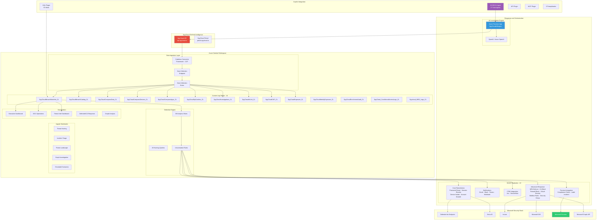

## Data Flow Architecture

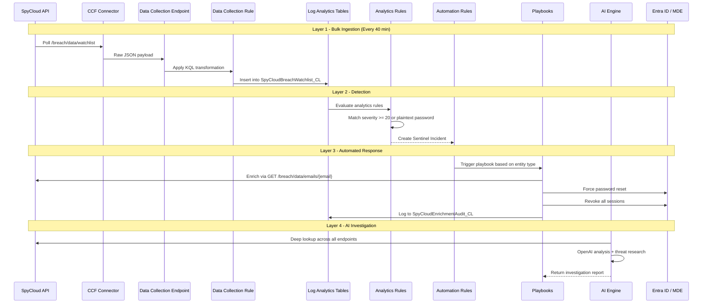

## Playbook Orchestration Flow

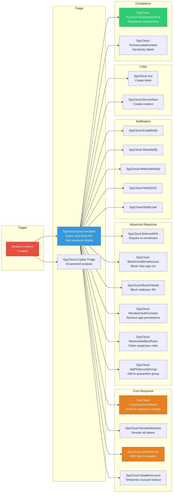

## AI Investigation Engine Architecture

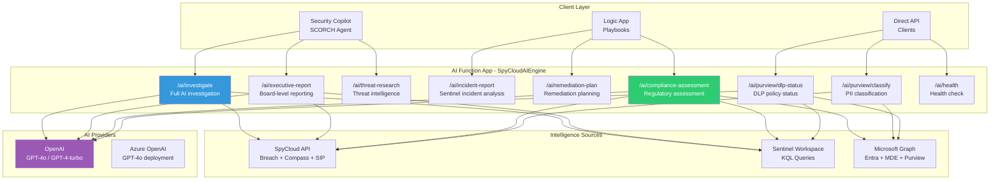

## Severity Model

SpyCloud uses a numeric severity model that drives all detection and response logic:

| Severity | Meaning | Example Data | Recommended Response |
|----------|---------|-------------|---------------------|
| **2** | Breach credential (hashed) | Email + hashed password from public breach | Monitor, notify user |
| **5** | Breach credential + PII | Email + password + name + phone + DOB | Force password reset, notify user |
| **20** | Infostealer credential | Email + plaintext password stolen by malware | Force reset, revoke sessions, investigate device |
| **25** | Infostealer + application data | Full browser data: passwords, cookies, tokens, autofill | Full remediation: reset, revoke, isolate device, MFA re-enrollment |

## Password Risk Model

| Password Type | Risk Level | Detection | Response |
|--------------|-----------|-----------|----------|
| `plaintext` | **Critical** | password_plaintext field populated | Immediate forced reset |
| `md5` / `sha1` | **High** | Easily crackable hashes | Forced reset within 24h |
| `sha256` / `sha512` | **Medium** | Computationally expensive but possible | Reset recommended |
| `bcrypt` / `scrypt` / `argon2` | **Low** | Resistant to cracking | Monitor, optional reset |

## Composite Risk Scoring

The solution calculates a composite risk score for each user identity:

```
Risk Score = (Severity x 4) + (Plaintext x 25) + (Sighting Count x 3)
           + (Recent Infection x 15) + (Multiple Domains x 10)
           + (No Remediation x 20)

Where:
  Severity: SpyCloud severity value (2-25)
  Plaintext: 1 if plaintext password available, 0 otherwise
  Sighting Count: Number of times credential observed
  Recent Infection: 1 if infected within 30 days
  Multiple Domains: 1 if same password used on 3+ domains
  No Remediation: 1 if no password reset within 7 days of exposure
```

| Score Range | Risk Level | Color | Auto-Response |
|------------|-----------|-------|--------------|
| 0-25 | Low | Green | Monitor only |
| 26-50 | Medium | Yellow | Notify user, recommend reset |
| 51-75 | High | Orange | Force reset, revoke sessions |
| 76-100 | Critical | Red | Full remediation + device isolation |

## Custom Log Tables Schema

### SpyCloudBreachWatchlist_CL (Primary Table)

| Column | Type | Description |
|--------|------|-------------|
| `email_s` | string | Exposed email address |
| `domain_s` | string | Email domain |
| `severity_d` | double | Severity level (2, 5, 20, 25) |
| `source_id_d` | double | Breach source identifier |
| `password_plaintext_s` | string | Plaintext password (if available) |
| `password_type_s` | string | Hash type or "plaintext" |
| `infected_machine_id_s` | string | Infostealer device ID |
| `infected_path_s` | string | Malware file path |
| `infected_time_t` | datetime | Time of infection |
| `ip_addresses_s` | string | Associated IP addresses |
| `target_url_s` | string | URL where credentials were used |
| `target_domain_s` | string | Domain of target service |
| `full_name_s` | string | Full name (PII) |
| `phone_s` | string | Phone number (PII) |
| `dob_s` | string | Date of birth (PII) |
| `ssn_s` | string | Social Security Number (PII) |
| `cc_number_s` | string | Credit card number (PII) |
| `user_browser_s` | string | Browser fingerprint |
| `user_os_s` | string | Operating system |
| `sighting_d` | double | Number of times credential observed |
| `TimeGenerated` | datetime | Ingestion timestamp |

## Network and Port Requirements

| Source | Destination | Port | Protocol | Purpose |
|--------|------------|------|----------|---------|
| Azure Sentinel | api.spycloud.io | 443 | HTTPS | SpyCloud API polling |
| Logic Apps | graph.microsoft.com | 443 | HTTPS | Entra ID, MDE, Purview operations |
| Logic Apps | management.azure.com | 443 | HTTPS | Azure Resource Manager |
| AI Engine | api.openai.com | 443 | HTTPS | OpenAI GPT-4 analysis |
| AI Engine | {resource}.openai.azure.com | 443 | HTTPS | Azure OpenAI (alternative) |
| MCP Server | Sentinel workspace | 443 | HTTPS | Graph queries and analysis |

## OAuth Token Scopes

| Scope | Used By | Purpose |
|-------|---------|---------|
| `User.ReadWrite.All` | Password Reset, Session Revoke | Modify user properties, revoke sessions |
| `Directory.ReadWrite.All` | Security Group, Account Disable | Group membership, account management |
| `SecurityEvents.ReadWrite.All` | Incident enrichment | Read/update Sentinel incidents |
| `Mail.ReadWrite` | Mailbox Rules removal | Remove suspicious mail rules |
| `Policy.ReadWrite.ConditionalAccess` | CA Block playbook | Modify Conditional Access policies |
| `DeviceManagementManagedDevices.ReadWrite.All` | Device Isolation | MDE device actions |
| `InformationProtection.Policy.Read.All` | Purview labels | Read sensitivity labels |
| `SecurityIncident.ReadWrite.All` | Purview label application | Tag incidents with labels |

## MITRE ATT&CK Mapping

| SpyCloud Detection | MITRE Technique | Tactic |
|-------------------|----------------|--------|
| Credential Exposure (Breach) | T1078 - Valid Accounts | Initial Access |
| Plaintext Password | T1552.001 - Credentials in Files | Credential Access |
| Infostealer Infection | T1555 - Credentials from Password Stores | Credential Access |
| Cookie/Session Theft | T1539 - Steal Web Session Cookie | Credential Access |
| Lateral Movement | T1021 - Remote Services | Lateral Movement |
| Mailbox Rule Creation | T1114.003 - Email Forwarding Rule | Collection |
| OAuth App Consent | T1098.003 - Additional Cloud Credentials | Persistence |
| MFA Registration Change | T1556.006 - Multi-Factor Authentication | Defense Evasion |
| Device Re-infection | T1204 - User Execution | Execution |
| Data Exfiltration | T1567 - Exfiltration Over Web Service | Exfiltration |

## Sentinel Graph Integration

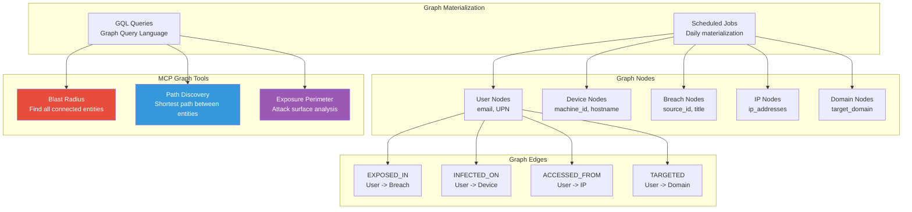

## Copilot Integration Architecture

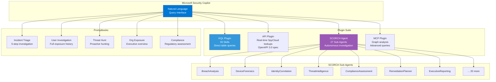

## PII Classification Framework

Maps 16 SpyCloud exposure field types to regulatory frameworks:

| Field | Category | GDPR | CCPA | HIPAA | PCI-DSS |
|-------|----------|------|------|-------|---------|
| `email` | Contact Info | Yes | Yes | No | No |
| `password` | Credential | Yes | Yes | No | Yes |
| `password_plaintext` | Plaintext Credential | Yes | Yes | No | Yes |
| `full_name` | Personal Identity | Yes | Yes | No | No |
| `phone` | Contact Info | Yes | Yes | No | No |
| `dob` | Sensitive PII | Yes | Yes | No | No |
| `ssn` | Government ID | Yes | Yes | No | No |
| `cc_number` | Financial | Yes | Yes | No | Yes |
| `cc_expiration` | Financial | Yes | Yes | No | Yes |
| `bank_number` | Financial | Yes | Yes | No | Yes |
| `ip_addresses` | Network Identity | Yes | Yes | Yes | No |
| `infected_machine_id` | Device Identity | Yes | Yes | Yes | No |
| `target_url` | Behavioral | Yes | Yes | No | No |
| `user_browser` | Device Fingerprint | Yes | Yes | No | No |
| `user_os` | Device Fingerprint | Yes | Yes | No | No |

### Sensitivity Label Mapping

| Classification | Sensitivity Level | Purview Label | Trigger |
|---------------|------------------|---------------|---------|
| Standard | Low | General | Email-only exposure |
| Confidential | Medium | Confidential | PII fields detected |
| Highly Confidential | High | Highly Confidential | Financial or sensitive PII |
| Highly Confidential - PHI | Critical | Highly Confidential - PHI | HIPAA-relevant fields (ip_addresses, infected_machine_id) |

## Deployment Architecture

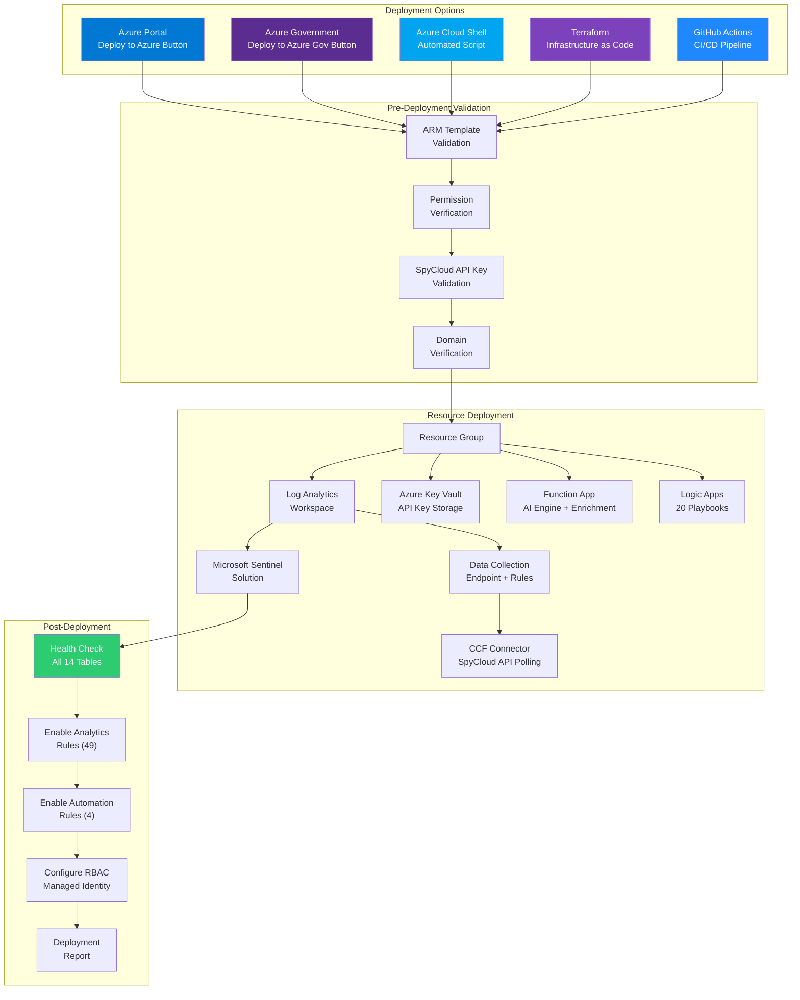

## Remediation Workflow

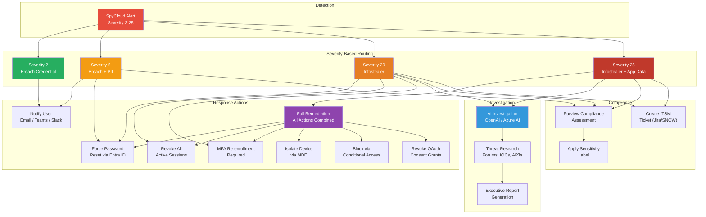

## Threat Hunting Mind Map

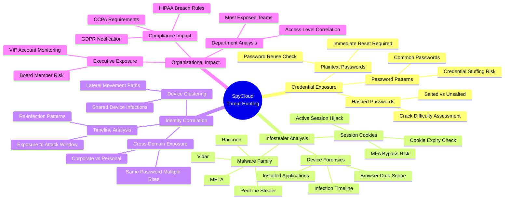

## Data Ingestion Pipeline Detail

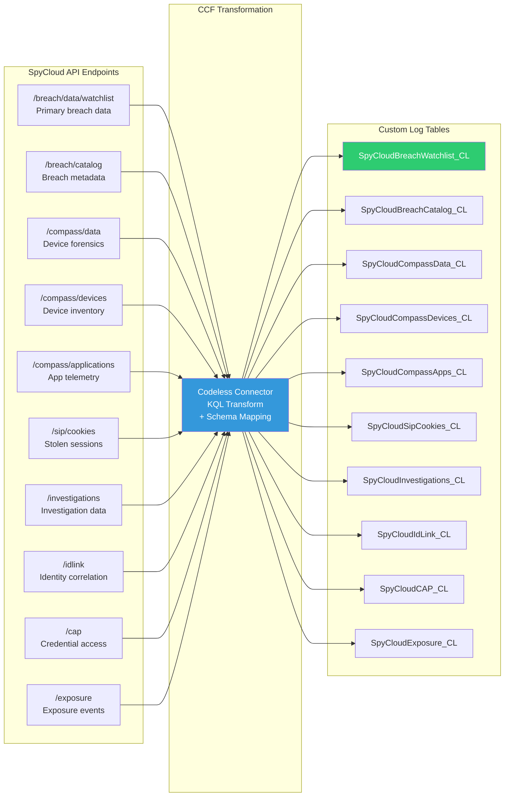

## Purview Integration Flow

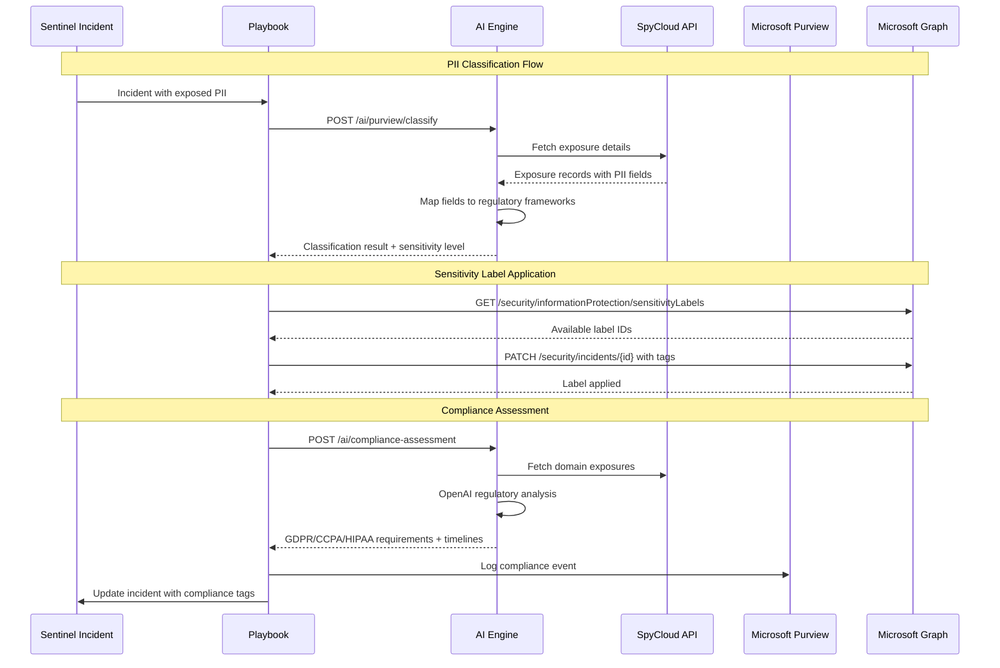

## Microsoft Security Stack Integration

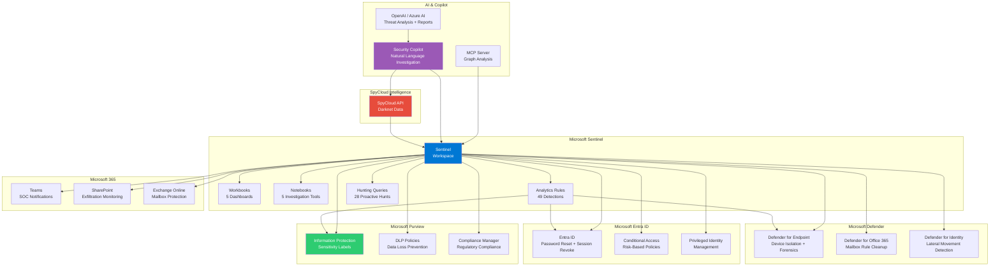
