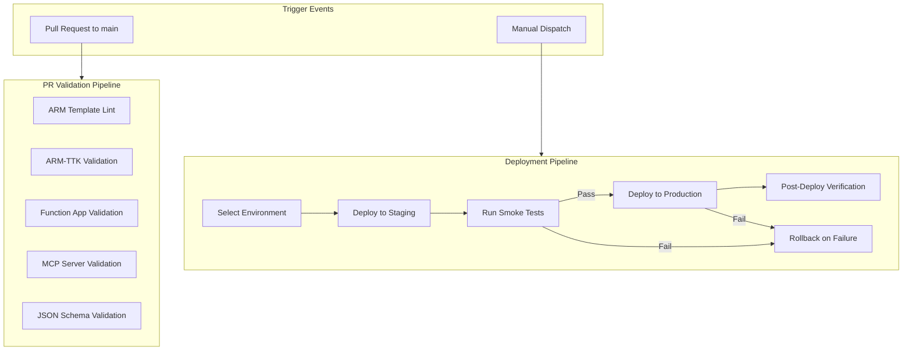

# GitHub Actions & CI/CD Pipeline Documentation

<div align="center">

**SpyCloud Identity Exposure Intelligence for Sentinel v2.0.0**

*Complete CI/CD pipeline configuration, workflow documentation, and deployment automation*

</div>

---

## Table of Contents

- [Overview](#overview)
- [Workflow Architecture](#workflow-architecture)
- [PR Validation Workflow](#pr-validation-workflow)
- [Deployment Workflow](#deployment-workflow)
- [Rollback Procedures](#rollback-procedures)
- [Environment Configuration](#environment-configuration)
- [Secrets Management](#secrets-management)
- [Troubleshooting](#troubleshooting)

---

## Overview

The SpyCloud Sentinel CI/CD pipeline uses GitHub Actions to automate validation, testing, and deployment of the solution across Azure environments.

### Pipeline Summary

| Workflow | File | Trigger | Purpose |
|----------|------|---------|---------|
| **PR Validation** | `.github/workflows/pr-validation.yml` | Pull requests to `main` | Validate ARM templates, Function App, MCP server, and code quality |
| **Sentinel Deploy** | `.github/workflows/sentinel-deploy.yml` | `workflow_dispatch` | Deploy to staging or production with automatic rollback |

---

## Workflow Architecture



---

## PR Validation Workflow

### File: `.github/workflows/pr-validation.yml`

This workflow runs automatically on every pull request targeting `main`.

### Jobs

#### 1. ARM Template Validation

Validates all ARM templates against the Azure Resource Manager Template Toolkit (ARM-TTK).

**What it checks:**
- JSON syntax and schema compliance
- Parameter definitions and default values
- Resource API versions are current
- Best practices for template structure
- `createUiDefinition.json` wizard validation

**Files validated:**
- `azuredeploy.json` -- Main deployment template
- `mainTemplate.json` -- Content Hub solution template
- `createUiDefinition.json` -- Deployment wizard definition
- `templates/**/*.json` -- All analytics, playbook, workbook, and automation templates

#### 2. Function App Validation

Validates the Python Function Apps can be imported and dependencies resolve.

**Steps:**
```yaml
- name: Set up Python
  uses: actions/setup-python@v5
  with:
    python-version: '3.11'

- name: Install dependencies
  run: |
    pip install -r functions/SpyCloudEnrichment/requirements.txt
    pip install -r functions/SpyCloudAIEngine/requirements.txt

- name: Validate imports
  run: |
    python -c "import function_app" 
  working-directory: functions/SpyCloudEnrichment

- name: Validate AI Engine imports
  run: |
    python -c "import function_app"
  working-directory: functions/SpyCloudAIEngine
```

#### 3. MCP Server Validation

Validates the Node.js MCP server builds and passes basic checks.

**Steps:**
```yaml
- name: Set up Node.js
  uses: actions/setup-node@v4
  with:
    node-version: '18'

- name: Install dependencies
  run: npm install
  working-directory: mcp-server

- name: Syntax check
  run: node --check src/index.js && node --check src/graph-tools.js
  working-directory: mcp-server
```

#### 4. JSON Schema Validation

Validates all JSON files are syntactically correct and follow expected schemas.

---

## Deployment Workflow

### File: `.github/workflows/sentinel-deploy.yml`

This workflow deploys the solution to Azure environments via manual dispatch.

### Trigger

```yaml
on:
  workflow_dispatch:
    inputs:
      environment:
        description: 'Target environment'
        required: true
        type: choice
        options:
          - staging
          - production
      spycloud_api_key:
        description: 'SpyCloud API Key'
        required: true
        type: string
      monitored_domain:
        description: 'Primary monitored domain'
        required: true
        type: string
      resource_group:
        description: 'Azure Resource Group'
        required: false
        type: string
        default: 'rg-spycloud-sentinel'
      location:
        description: 'Azure Region'
        required: false
        type: string
        default: 'eastus'
```

### Deployment Steps

```mermaid
flowchart LR
    subgraph Pre["Pre-Deployment"]
        AUTH["Azure Login"]
        VAL["Validate Template"]
        RG["Create Resource Group"]
    end

    subgraph Deploy["Deployment"]
        ARM["Deploy ARM Template"]
        RBAC["Configure RBAC"]
        PERM["Grant Permissions"]
    end

    subgraph Post["Post-Deployment"]
        HEALTH["Health Check"]
        RULES["Enable Analytics Rules"]
        AUTO["Enable Automation Rules"]
        REPORT["Generate Report"]
    end

    AUTH --> VAL --> RG --> ARM --> RBAC --> PERM --> HEALTH --> RULES --> AUTO --> REPORT
```



#### Step 1: Azure Authentication

```yaml
- name: Azure Login
  uses: azure/login@v2
  with:
    creds: ${{ secrets.AZURE_CREDENTIALS }}
```

#### Step 2: Template Validation

```yaml
- name: Validate ARM Template
  uses: azure/arm-deploy@v2
  with:
    scope: resourcegroup
    resourceGroupName: ${{ inputs.resource_group }}
    template: azuredeploy.json
    deploymentMode: Validate
    parameters: >
      apiKey=${{ inputs.spycloud_api_key }}
      monitoredDomain=${{ inputs.monitored_domain }}
```

#### Step 3: Deploy ARM Template

```yaml
- name: Deploy to Azure
  id: deploy
  uses: azure/arm-deploy@v2
  with:
    scope: resourcegroup
    resourceGroupName: ${{ inputs.resource_group }}
    template: azuredeploy.json
    parameters: >
      apiKey=${{ inputs.spycloud_api_key }}
      monitoredDomain=${{ inputs.monitored_domain }}
    deploymentName: spycloud-${{ github.run_id }}
```

#### Step 4: Post-Deployment Health Check

```yaml
- name: Health Check
  run: |
    chmod +x scripts/spycloud-toolkit.sh
    ./scripts/spycloud-toolkit.sh health-check
  env:
    AZURE_SUBSCRIPTION_ID: ${{ secrets.AZURE_SUBSCRIPTION_ID }}
    RESOURCE_GROUP: ${{ inputs.resource_group }}
    WORKSPACE_NAME: ${{ steps.deploy.outputs.workspaceName }}
```

#### Step 5: Rollback on Failure

```yaml
- name: Rollback on Failure
  if: failure()
  run: |
    echo "Deployment failed. Initiating rollback..."
    az deployment group cancel \
      --resource-group ${{ inputs.resource_group }} \
      --name spycloud-${{ github.run_id }} || true
    
    # Delete resources created in this deployment
    az group deployment delete \
      --resource-group ${{ inputs.resource_group }} \
      --name spycloud-${{ github.run_id }} || true
    
    echo "Rollback complete. Check Azure Activity Log for details."
```

---

## Rollback Procedures

### Automatic Rollback

The deployment workflow automatically rolls back on failure:

1. **Template validation failure** -- Deployment is blocked before any resources are created
2. **ARM deployment failure** -- Deployment is cancelled and partial resources cleaned up
3. **Post-deployment health check failure** -- Resources remain but analytics rules are not enabled

### Manual Rollback

If you need to manually roll back a deployment:

```bash
# List recent deployments
az deployment group list \
  --resource-group rg-spycloud-sentinel \
  --query "[?properties.provisioningState=='Succeeded'].{Name:name, Time:properties.timestamp}" \
  --output table

# Delete the failed deployment's resources
az deployment group delete \
  --resource-group rg-spycloud-sentinel \
  --name <deployment-name>

# Or delete the entire resource group to start fresh
az group delete --name rg-spycloud-sentinel --yes --no-wait
```

### Rollback Checklist

| Step | Action | Command |
|------|--------|---------|
| 1 | Cancel running deployment | `az deployment group cancel -g <rg> -n <name>` |
| 2 | Disable analytics rules | `./scripts/spycloud-toolkit.sh verify-analytics --disable` |
| 3 | Disable automation rules | Via Sentinel portal > Automation |
| 4 | Delete Logic Apps | `az logic workflow delete -g <rg> -n <name>` |
| 5 | Delete Function App | `az functionapp delete -g <rg> -n <name>` |
| 6 | Verify data tables preserved | Tables persist in workspace |

---

## Environment Configuration

### Required GitHub Secrets

| Secret | Description | How to Create |
|--------|-------------|---------------|
| `AZURE_CREDENTIALS` | Azure service principal JSON | `az ad sp create-for-rbac --name "spycloud-ci" --role Contributor --scopes /subscriptions/<id>` |
| `AZURE_SUBSCRIPTION_ID` | Azure subscription ID | Azure Portal > Subscriptions |
| `SPYCLOUD_API_KEY` | SpyCloud Enterprise API key | [portal.spycloud.com](https://portal.spycloud.com) > Settings > API Keys |

### Creating the Service Principal

```bash
# Create a service principal with Contributor access
az ad sp create-for-rbac \
  --name "spycloud-sentinel-ci" \
  --role Contributor \
  --scopes /subscriptions/<subscription-id> \
  --json-auth

# Copy the output JSON and add it as AZURE_CREDENTIALS secret in GitHub
```

### Environment Variables

| Variable | Staging | Production |
|----------|---------|------------|
| `RESOURCE_GROUP` | `rg-spycloud-sentinel-staging` | `rg-spycloud-sentinel` |
| `LOCATION` | `eastus2` | `eastus` |
| `SEVERITY_THRESHOLD` | `2` | `20` |
| `POLLING_INTERVAL` | `4h` | `4h` |

---

## Secrets Management

### GitHub Secrets Setup

1. Navigate to **Repository** > **Settings** > **Secrets and variables** > **Actions**
2. Click **New repository secret**
3. Add each required secret

### Rotation Schedule

| Secret | Rotation Period | How to Rotate |
|--------|:--------------:|---------------|
| `AZURE_CREDENTIALS` | 90 days | `az ad sp credential reset --name spycloud-sentinel-ci` |
| `SPYCLOUD_API_KEY` | As needed | Regenerate at [portal.spycloud.com](https://portal.spycloud.com) |

---

## Troubleshooting

### Common CI Failures

| Error | Cause | Fix |
|-------|-------|-----|
| `ARM-TTK validation failed` | Template syntax issue | Check ARM-TTK output for specific rule violations |
| `Azure login failed` | Expired or invalid service principal | Rotate `AZURE_CREDENTIALS` secret |
| `Template deployment failed` | Resource provider not registered | Register providers: `az provider register -n Microsoft.OperationalInsights` |
| `Function App import error` | Missing Python dependency | Add dependency to `requirements.txt` |
| `MCP server syntax error` | JavaScript syntax issue | Run `node --check <file>` locally |
| `Health check failed` | Resources not fully provisioned | Wait 5 minutes and re-run health check |

### Viewing Workflow Logs

1. Navigate to **Actions** tab in the repository
2. Click on the failed workflow run
3. Expand the failed job and step
4. Review the log output for error details

### Running Workflows Manually

```bash
# Trigger the deploy workflow via GitHub CLI
gh workflow run sentinel-deploy.yml \
  -f environment=staging \
  -f spycloud_api_key="$SPYCLOUD_API_KEY" \
  -f monitored_domain="contoso.com"
```

---

<div align="center">

**SpyCloud Identity Exposure Intelligence for Sentinel**

*CI/CD Pipeline Documentation v2.0.0*

</div>
