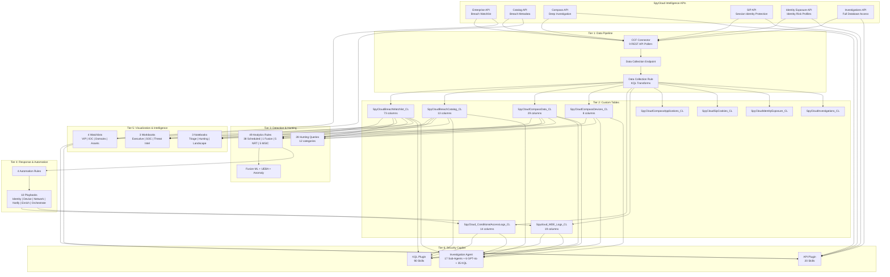

# SpyCloud Sentinel v8.0 -- Architecture & Quick Reference

## Deployment Architecture



## What Gets Deployed

| Tier | Components | Count | Default |
|------|-----------|-------|---------|
| **Foundation** | Workspace, Sentinel, DCE, DCR, 10 Custom Tables, CCF Connector (9 pollers), Content Package | 14 | Always |
| **Detection** | Analytics Rules (Core, O365, UEBA, Advanced, MSIC, Fusion, NRT) | 49 | All ON |
| **Playbooks** | Identity, Device, Network, Notification, Enrichment, Orchestration | 10 | All ON |
| **Dashboards** | Executive Dashboard, SOC Operations, Threat Intel | 3 | All ON |
| **Investigation** | Hunting Queries, Jupyter Notebooks | 31 | All ON |
| **Watchlists** | VIP/Executive, IOC Blocklist, Approved Domains, High-Value Assets | 4 | All ON |
| **Copilot** | KQL Plugin (90), API Plugin (20), Investigation Agent (58) | 168 skills | All ON |
| **Platform** | UEBA, Anomaly Detection, Fusion ML, MSIC Rules | 4 | All ON |

## 10 Custom Tables

| Table | Columns | Source | Description |
|-------|---------|--------|-------------|
| `SpyCloudBreachWatchlist_CL` | 73 | Enterprise API | Credential exposures, PII, device forensics, infostealer artifacts |
| `SpyCloudBreachCatalog_CL` | 13 | Catalog API | Breach metadata -- title, description, category, confidence |
| `SpyCloudCompassData_CL` | 29 | Compass API | Consumer/partner identity exposures (Enterprise+ only) |
| `SpyCloudCompassDevices_CL` | 8 | Compass API | Infected device fingerprints and malware artifacts |
| `SpyCloudCompassApplications_CL` | -- | Compass API | Application-level stolen credential data |
| `SpyCloudSipCookies_CL` | -- | SIP API | Stolen session cookies and token data |
| `SpyCloudIdentityExposure_CL` | -- | Identity API | Aggregated identity exposure profiles |
| `SpyCloudInvestigations_CL` | -- | Investigations API | Full database investigation records |
| `SpyCloud_ConditionalAccessLogs_CL` | 14 | Playbook output | Identity remediation audit trail |
| `Spycloud_MDE_Logs_CL` | 19 | Playbook output | MDE device isolation and tagging audit trail |

## Data Flow

```
SpyCloud APIs (6 endpoints)
    | X-API-Key header auth
    v
CCF REST API Pollers (9 independent pollers)
    | HTTPS POST
    v
Data Collection Endpoint (DCE)
    | Routing
    v
Data Collection Rule (DCR) -- KQL transforms
    | Normalized & routed
    v
10 Custom Tables in Log Analytics
    | Correlated with SigninLogs, AuditLogs, UEBA, Firewalls, DNS,
    | DeviceInfo, IdentityLogonEvents, CloudAppEvents, IntuneDevices
    v
49 Analytics Rules --> Sentinel Incidents
    | Automation Rules
    v
10 Playbooks --> Password Reset, Session Revocation, MFA Enforcement,
                 CA Blocking, Firewall Blocking, Device Isolation,
                 User Notify, SOC Notify, Incident Enrichment,
                 Full Remediation Orchestration
```

## Authentication

| Component | Auth Method | Details |
|-----------|------------|---------|
| **SpyCloud API** | API Key | `X-API-Key` header with SpyCloud-issued key |
| **CCF Connector** | API Key | Same `X-API-Key` configured in connector settings |
| **Copilot KQL Plugin** | None (Sentinel RBAC) | Uses workspace identity via TenantId, SubscriptionId, ResourceGroupName, WorkspaceName |
| **Copilot API Plugin** | API Key | `X-API-Key` header, AuthScheme: empty, Location: Header |
| **Copilot Agent** | None (Sentinel RBAC) | Same workspace settings as KQL Plugin; optional SpyCloudApiKey for API Plugin integration |
| **Playbooks** | Managed Identity | System-assigned managed identity with Graph API and MDE API permissions |

## API Endpoints

| API | Endpoint | Table | Tier |
|-----|----------|-------|------|
| Enterprise | `/enterprise-v2/breach/data/watchlist` (new) | SpyCloudBreachWatchlist_CL | Enterprise |
| Enterprise | `/enterprise-v2/breach/data/watchlist` (modified) | SpyCloudBreachWatchlist_CL | Enterprise |
| Catalog | `/enterprise-v2/breach/catalog` | SpyCloudBreachCatalog_CL | Enterprise |
| Compass | `/enterprise-v2/compass/data` | SpyCloudCompassData_CL | Enterprise+ |
| Compass | `/enterprise-v2/compass/devices` | SpyCloudCompassDevices_CL | Enterprise+ |
| SIP | `/sip/breach/data/cookies` | SpyCloudSipCookies_CL | SIP |
| Identity | `/identity/exposure` | SpyCloudIdentityExposure_CL | Enterprise |
| Investigations | `/investigations/data` | SpyCloudInvestigations_CL | Investigations |
| Enterprise | (playbook output) | SpyCloud_ConditionalAccessLogs_CL | -- |

## Severity Levels

| Level | Label | Risk | Auto-Response |
|-------|-------|------|--------------|
| **25** | Infostealer + App Data | Critical (MFA bypass risk) | Block all access + isolate device + revoke sessions + SOC alert |
| **20** | Infostealer Credential | Urgent | Force password reset + revoke sessions + MFA re-registration |
| **5** | Breach + PII | High | Reset password + monitor |
| **2** | Breach Credential | Medium | Notify user |

## Deployment Options

### ARM Template (Recommended)
```bash
az deployment group create \
  --resource-group <rg-name> \
  --template-file azuredeploy.json \
  --parameters azuredeploy.parameters.json
```

### Terraform
```bash
cd terraform/
cp terraform.tfvars.example terraform.tfvars
# Edit terraform.tfvars with your values
terraform init && terraform plan && terraform apply
```

### GitHub Actions CI/CD
Push to `main` branch triggers automated deployment pipeline with validation, linting, and ARM/Terraform deployment steps.

### Azure Cloud Shell
```bash
chmod +x scripts/deploy-wizard.sh
./scripts/deploy-wizard.sh
```

### Azure Portal Wizard
Deploy via the Azure Portal custom deployment UI using the `azuredeploy.json` template with guided parameter input.

## Post-Deployment Automation

Run `scripts/post-deploy-auto.sh` to automatically:

1. Resolve DCE/DCR identifiers
2. Assign RBAC roles (Monitoring Metrics Publisher, Sentinel Responder)
3. Grant Graph API permissions to all playbook managed identities
4. Grant MDE API permissions (Machine.Isolate, Machine.ReadWrite.All)
5. Grant admin consent for all permissions
6. Enable all deployed analytics rules
7. Verify deployment health (10-point check)

## RBAC Requirements

| Role | Scope | Purpose |
|------|-------|---------|
| Microsoft Sentinel Contributor | Resource Group | Deploy connectors, rules, watchlists |
| Log Analytics Contributor | Resource Group | Create tables, DCR, DCE |
| Logic App Contributor | Resource Group | Deploy playbooks |
| Managed Identity Operator | Resource Group | Assign playbook identities |
| Security Administrator | Workspace | Configure UEBA |

## MITRE ATT&CK Coverage

| Tactic | Techniques | Rules |
|--------|-----------|-------|
| Initial Access | T1078, T1078.004, T1133 | sc-001, 020, 021, 036 |
| Persistence | T1098, T1556.006 | sc-023, 025, 026 |
| Credential Access | T1555, T1539, T1552, T1110.004 | sc-002, 003, 006, 008 |
| Defense Evasion | T1550, T1550.004 | sc-003, 022, 041 |
| Lateral Movement | T1021, T1534 | sc-039, 040 |
| Collection | T1114, T1213, T1005 | sc-024, 028, 029 |
| Exfiltration | T1048, T1530 | sc-028, 029 |
| Execution | T1059, T1204 | sc-007, 009, 047 |

## Security Copilot Integration Summary

| Plugin | Skills | Auth | Purpose |
|--------|--------|------|---------|
| **KQL Plugin** | 90 | Sentinel RBAC | Query all SpyCloud tables via natural language KQL |
| **API Plugin** | 20 | X-API-Key | Real-time SpyCloud API lookups across 6 APIs |
| **Investigation Agent** | 58 (17 sub-agents + 6 GPT-4o + 35 KQL) | Sentinel RBAC | Autonomous multi-step investigation with SENTINEL persona |
| **Total** | **168** | -- | -- |

---

*SpyCloud Sentinel v8.0.0 -- Darknet & Identity Threat Exposure Intelligence*
