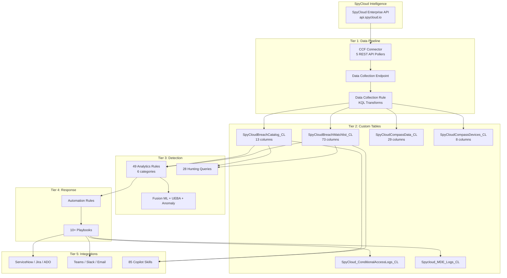

# SpyCloud Sentinel v6.0 — Architecture & Quick Reference

## Deployment Architecture



## What Gets Deployed

| Tier | Components | Count | Default |
|------|-----------|-------|---------|
| **Foundation** | Workspace, Sentinel, DCE, DCR, 6 Custom Tables, CCF Connector, Content Package | 12 | Always |
| **Detection** | Analytics Rules (Core, O365, UEBA, Advanced, MSIC, Fusion) | 49 | All ON |
| **Playbooks** | Identity, Device, Network, Notification, Enrichment, Orchestration | 10+ | All ON |
| **Dashboards** | Executive Dashboard, SOC Operations, Threat Intel | 3 | All ON |
| **Investigation** | Hunting Queries, Jupyter Notebooks, Copilot Skills | 85+ | All ON |
| **Integrations** | ServiceNow, Jira, Azure DevOps, Slack, Teams, Email | 6 | Configure |
| **Platform** | UEBA, Anomaly Detection, Fusion ML, MSIC Rules | 4 | All ON |

## Data Flow

```
SpyCloud API (5 endpoints)
    ↓ X-Api-Key header auth
CCF REST API Pollers (5 independent pollers)
    ↓ HTTPS POST
Data Collection Endpoint (DCE)
    ↓ Routing
Data Collection Rule (DCR) — KQL transforms
    ↓ Normalized & routed
6 Custom Tables in Log Analytics
    ↓ Correlated with SigninLogs, AuditLogs, UEBA, Firewalls, DNS
49 Analytics Rules → Sentinel Incidents
    ↓ Automation Rules
10+ Playbooks → Password Reset, Session Revocation, MFA, Device Isolation, CA, Notifications
```

## API Endpoints

| Endpoint | Table | Tier |
|----------|-------|------|
| `/enterprise-v2/breach/data/watchlist` (new) | SpyCloudBreachWatchlist_CL | Enterprise |
| `/enterprise-v2/breach/data/watchlist` (modified) | SpyCloudBreachWatchlist_CL | Enterprise |
| `/enterprise-v2/breach/catalog` | SpyCloudBreachCatalog_CL | Enterprise |
| `/enterprise-v2/compass/data` | SpyCloudCompassData_CL | Enterprise+ |
| `/enterprise-v2/compass/devices` | SpyCloudCompassDevices_CL | Enterprise+ |

## Severity Levels

| Level | Meaning | Auto-Response |
|-------|---------|--------------|
| **25** | Session cookies/tokens stolen (MFA bypass) | Block all access + isolate device + revoke sessions + SOC alert |
| **20** | Infostealer malware credentials | Force password reset + revoke sessions + MFA re-registration |
| **5** | Credentials in breach with PII | Reset password + monitor |
| **2** | Credentials in breach (no PII) | Notify user |

## Post-Deployment Automation

Run `scripts/post-deploy-auto.sh` to automatically:

1. Resolve DCE/DCR identifiers
2. Assign RBAC roles (Monitoring Metrics Publisher, Sentinel Responder)
3. Grant Graph API permissions to all playbook managed identities
4. Grant MDE API permissions (Machine.Isolate, Machine.ReadWrite.All)
5. Grant admin consent for all permissions
6. Enable all deployed analytics rules
7. Verify deployment health (10-point check)

## RBAC Requirements

| Role | Scope | Purpose |
|------|-------|---------|
| Microsoft Sentinel Contributor | Resource Group | Deploy connectors, rules, watchlists |
| Log Analytics Contributor | Resource Group | Create tables, DCR, DCE |
| Logic App Contributor | Resource Group | Deploy playbooks |
| Managed Identity Operator | Resource Group | Assign playbook identities |
| Security Administrator | Workspace | Configure UEBA |

## MITRE ATT&CK Coverage

| Tactic | Techniques | Rules |
|--------|-----------|-------|
| Initial Access | T1078, T1078.004, T1133 | sc-001, 020, 021, 036 |
| Persistence | T1098, T1556.006 | sc-023, 025, 026 |
| Credential Access | T1555, T1539, T1552, T1110.004 | sc-002, 003, 006, 008 |
| Defense Evasion | T1550, T1550.004 | sc-003, 022, 041 |
| Lateral Movement | T1021, T1534 | sc-039, 040 |
| Collection | T1114, T1213, T1005 | sc-024, 028, 029 |
| Exfiltration | T1048, T1530 | sc-028, 029 |
| Execution | T1059, T1204 | sc-007, 009, 047 |
